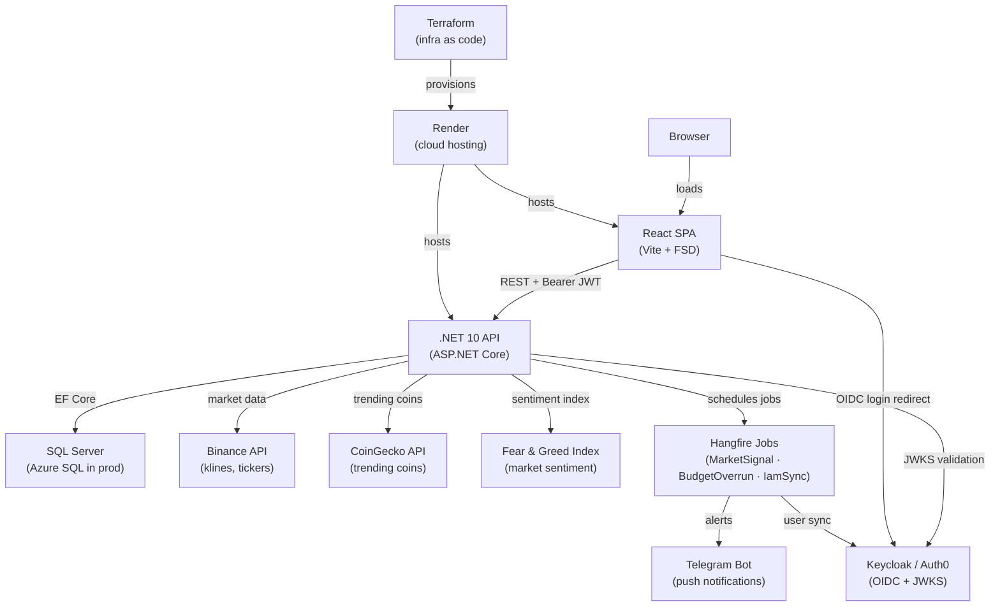

# FinTrackPro — Architecture

## Overview

Clean Architecture with CQRS. Dependencies point inward — outer layers depend on inner layers, never the reverse.

```
[ API / BackgroundJobs ]
         ↓
    [ Application ]
         ↓
       [ Domain ]
         ↑
  [ Infrastructure ]  (implements interfaces defined in Domain/Application)
```

## System Context



## Layer Responsibilities

### Domain (`FinTrackPro.Domain`)
- Entities, enums, domain exceptions
- Repository interfaces (`IUserRepository`, etc.)
- Zero external dependencies

### Application (`FinTrackPro.Application`)
- CQRS commands and queries via MediatR
- FluentValidation validators
- Service interfaces (`ICurrentUserService`, `INotificationService`, `IBinanceService`, etc.)
- DTOs (explicit `operator` conversions, no AutoMapper)
- Pipeline behaviors: `ValidationBehavior` → `LoggingBehavior` → `EnsureUserBehavior` (auto-provisions `AppUser` on first login)

### Infrastructure (`FinTrackPro.Infrastructure`)
- EF Core `ApplicationDbContext` + entity configurations
- Repository implementations
- External services: `BinanceService`, `FearGreedService`, `CoinGeckoService`
- `TelegramNotificationChannel`, `NotificationService`
- `CurrentUserService` (reads JWT claims via `IHttpContextAccessor`; also exposes `ProviderName` from config)
- **IAM provider abstraction** — selected at startup via `IdentityProvider:Provider` config key:
  - `KeycloakClaimsTransformer` — flattens `realm_access.roles` into `ClaimTypes.Role` claims
  - `Auth0ClaimsTransformer` — reads `https://fintrackpro.dev/roles` custom claim (set by Auth0 post-login Action)
  - `KeycloakAdminService` (`IIamProviderService`) — calls Keycloak Admin REST API via client-credentials
  - `Auth0ManagementService` (`IIamProviderService`) — calls Auth0 Management API v2 via client-credentials
- `IMemoryCache` for external API responses

### API (`FinTrackPro.API`)
- Thin controllers — delegate to `Mediator.Send()`
- `ExceptionHandlingMiddleware` maps exceptions to HTTP status codes
- JWT Bearer authentication — provider-conditional: Keycloak (Authority + MetadataAddress) or Auth0 (Authority only)
- Hangfire dashboard + recurring job registration
- Scalar API UI (`/scalar`)
- CORS policy for SPA

### BackgroundJobs (`FinTrackPro.BackgroundJobs`)
- `MarketSignalJob` — every 4h: RSI + volume spike signals via Skender + Binance
- `BudgetOverrunJob` — daily: checks category spending vs budget limits
- `IamUserSyncJob` — daily: diffs active IAM provider users against `AppUser` table; deactivates rows for deleted or disabled accounts

See [background-jobs.md](background-jobs.md) for detailed sequence diagrams of each job.

## Frontend Architecture (FSD)

Feature-Sliced Design — layers import only downward.

```
app → pages → widgets → features → entities → shared
```

| Layer | Contents |
|---|---|
| `app/` | QueryProvider, BrowserRouter + Outlet layout, global CSS |
| `pages/` | DashboardPage, TransactionsPage, BudgetsPage, TradesPage, SettingsPage |
| `widgets/` | Navbar, FearGreedWidget, SignalsList |
| `features/` | AddTransactionForm, AddTradeForm, AddBudgetForm, NotificationSettingsForm, WatchlistManager, authStore (Zustand — `accessToken`, `displayName`, `email`, `isAuthenticated`) |
| `entities/` | transaction, trade, signal, budget, watched-symbol, notification-preference — types + React Query hooks |
| `shared/` | Axios client (Bearer injection + redirect on 401), `auth/` adapter (Keycloak or Auth0), env config, `cn()` |

## Key Design Decisions

| Decision | Choice | Reason |
|---|---|---|
| ORM | EF Core 10 + SQL Server (local Docker) / Azure SQL (production) | Type-safe migrations, Clean Arch compatible; same provider targets both |
| CQRS | MediatR 12 | Decoupled handlers, pipeline behaviors |
| Validation | FluentValidation 11 | Declarative, auto-wired via DI |
| Auth | Keycloak / Auth0 + JWT Bearer | Swappable IAM providers via `IdentityProvider:Provider` config. Roles (`User`/`Admin`) live in the IAM provider only; the active claims transformer maps them to ASP.NET Core `ClaimTypes.Role`. Local `AppUser` stores `ExternalUserId` (JWT `sub`) + `Provider` field; profile is synced on every login via `EnsureUserBehavior`; orphans are soft-deleted nightly by `IamUserSyncJob`. |
| Background jobs | Hangfire + SQL Server storage | Persistent job history, retry policy |
| Indicators | Skender.Stock.Indicators | Free, NuGet, covers RSI/EMA/BB |
| Notifications | Telegram Bot | No cost, no email infra |
| Caching | IMemoryCache (in-process) | Single instance — swap to Redis when scaling |
| API docs | Scalar + .NET 10 built-in OpenAPI | Swashbuckle incompatible with .NET 10 |
| Frontend state | React Query (server) + Zustand (client) | Clear separation of concerns |

## Infrastructure

### Terraform (`infra/terraform/`)

Render services are managed as code using the official `render-oss/render` Terraform provider.
State is stored in **Terraform Cloud** (free tier). See [render-terraform-deploy.md](render-terraform-deploy.md) for the full deploy guide.

| Resource | Type | Description |
|---|---|---|
| `render_web_service.api` | Docker Web Service | .NET 10 API — Starter plan, Oregon region |
| `render_static_site.frontend` | Static Site | React/Vite SPA — CDN-distributed globally |

All secrets are stored as sensitive Terraform Cloud workspace variables — never committed to source.
See [infra/terraform/variables.tf](../infra/terraform/variables.tf) for the full variable list and
[infra/terraform/terraform.tfvars.example](../infra/terraform/terraform.tfvars.example) for a safe example.

### render.yaml

The `render.yaml` Blueprint at the repo root is retained as a **fallback** for manual one-click Render dashboard deploys. Terraform is the authoritative deployment tool.
