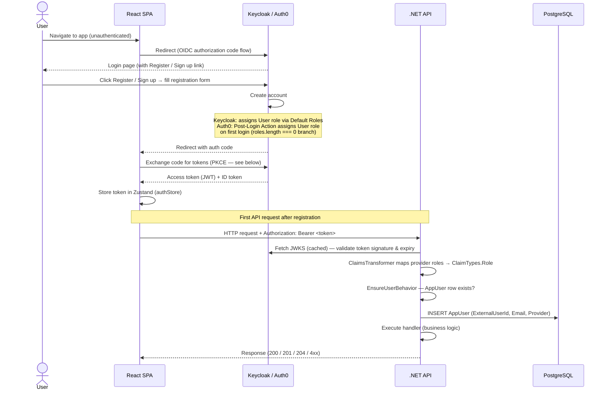
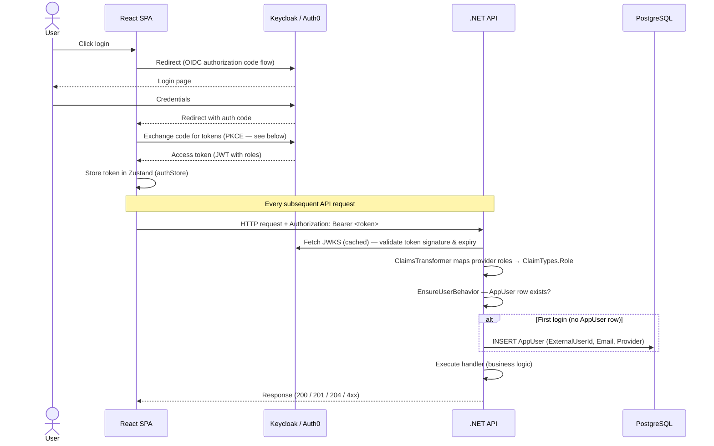
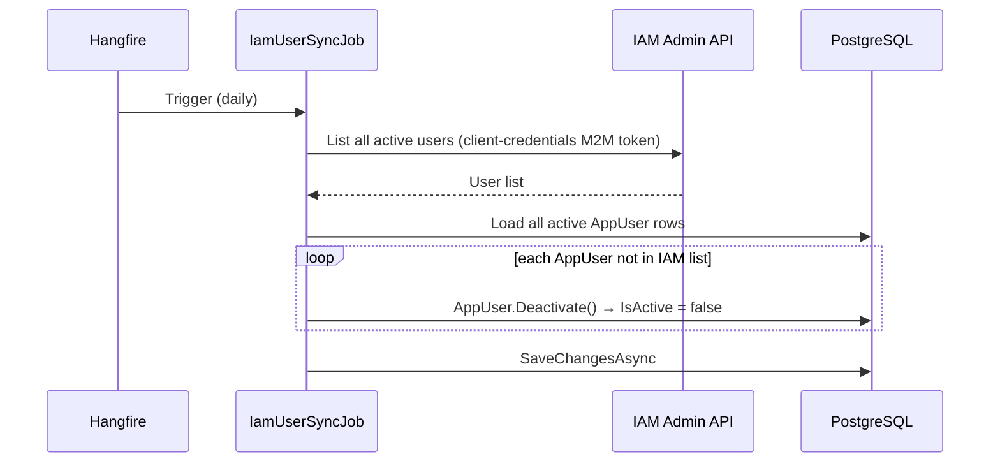
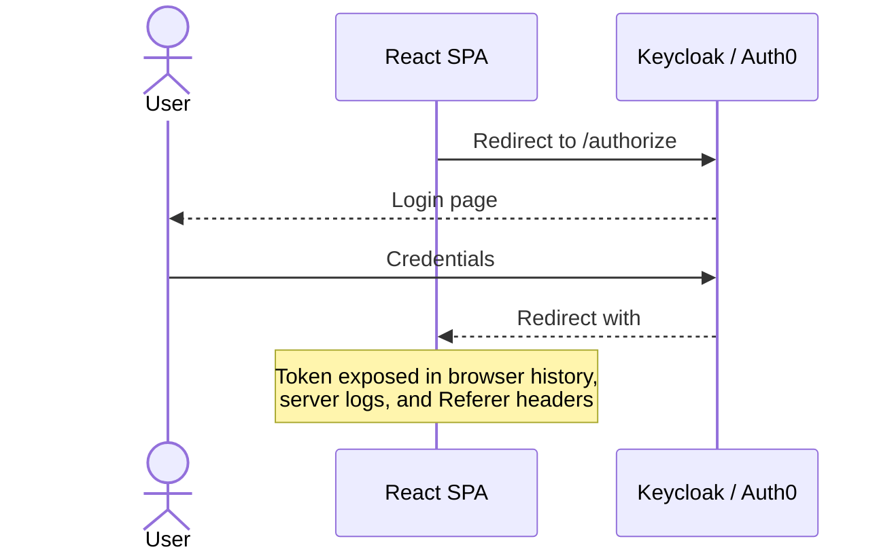
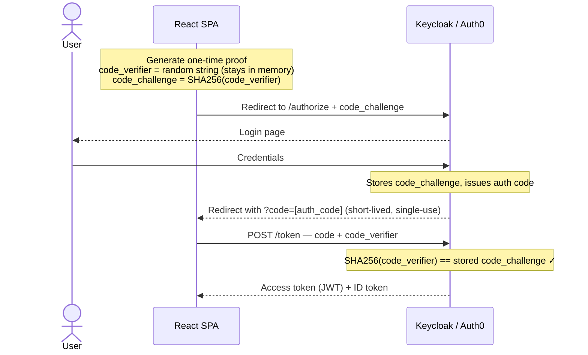

# Auth System — Architecture Reference

This document covers how the auth system works: provider overview, authentication flows, and provider switching.

> For step-by-step setup instructions, see [auth-setup.md](../guides/auth-setup.md).

## Contents

- [Provider Overview](#provider-overview)
- [Auth Flows](#auth-flows)
  - [Sign-up / Registration](#sign-up--registration)
  - [Login & API Request](#login--api-request)
  - [Nightly IAM User Sync](#nightly-iam-user-sync)
- [How the Code Exchange Works (PKCE)](#how-the-code-exchange-works-pkce)
- [Switching Providers](#switching-providers)

---

## Provider Overview

FinTrackPro supports two interchangeable IAM providers. The provider is selected by a single config key — no code changes required.

| | Keycloak | Auth0 |
|---|---|---|
| **Hosting** | Self-hosted (Docker) | Cloud (SaaS) |
| **Best for** | Local dev, on-prem | Cloud deployments, no-infra dev |
| **Free tier** | Unlimited | 7,500 MAU |
| **Setup effort** | Zero (auto-provisioned) | One-time dashboard config |
| **Config key** | `"keycloak"` | `"auth0"` |

Both providers issue JWT Bearer tokens. All RBAC rules, controllers, and handlers are identical — only infrastructure and config differ.

---

## Auth Flows

### Sign-up / Registration



> The "Redirect with auth code" and "Exchange code for tokens" steps are the PKCE handshake — see [How the Code Exchange Works (PKCE)](#how-the-code-exchange-works-pkce) below.

### Login & API Request



> The "Redirect with auth code" and "Exchange code for tokens" steps are the PKCE handshake — see [How the Code Exchange Works (PKCE)](#how-the-code-exchange-works-pkce) below.

### Nightly IAM User Sync



---

## How the Code Exchange Works (PKCE)

### Before: Implicit Flow (deprecated)

The original browser OAuth2 approach returned the token directly in the redirect URL:



A JWT in the URL is dangerous — it leaks into browser history, server access logs, and `Referer` headers sent to third-party resources on the page.

### Now: Authorization Code Flow + PKCE

Instead of the token, the IAM puts a short-lived **auth code** in the redirect. The SPA then exchanges that code for the real token in a separate request — keeping the JWT out of the URL entirely.

For server-side apps this exchange is protected by a **client secret**. A React SPA can't use a secret (all its code is visible in the browser), so **PKCE** replaces it with a one-time challenge-response that proves the same browser that started the login is the one completing it.



An attacker who intercepts `?code=` from the redirect URL cannot complete the exchange — they never saw the `code_verifier`.

### What each value is

| Value | What it is | Where it lives |
|---|---|---|
| `code_verifier` | Random string generated fresh per login | SPA memory — never put in the URL |
| `code_challenge` | `SHA256(code_verifier)` — a one-way fingerprint of the verifier | Sent to IAM upfront in the redirect |
| `auth code` | Short-lived (≈60s) single-use code issued by the IAM | URL `?code=` param — useless without the verifier |
| `access token` | The real JWT the API validates on every request | Returned only after code + verifier are verified |

### URL reference

**Implicit Flow — single redirect (deprecated)**

```
# Step 1: SPA → IAM
GET /authorize
  ?response_type=token          ← required  (marks this as Implicit Flow)
  &client_id=fintrackpro-spa    ← required
  &redirect_uri=http://localhost:5173/callback  ← required
  &scope=openid profile email   ← required: openid; profile/email optional
  &state=random-csrf-token      ← recommended (CSRF protection)

# IAM response — token lands directly in the URL fragment
http://localhost:5173/callback
  #access_token=[JWT]           ← token exposed in URL ⚠️
  &token_type=Bearer
  &expires_in=300
  &state=random-csrf-token
```

**Authorization Code Flow + PKCE — two-step (current)**

```
# Step 1: SPA → IAM  (redirect)
GET /authorize
  ?response_type=code           ← required  (marks this as Auth Code Flow)
  &client_id=fintrackpro-spa    ← required
  &redirect_uri=http://localhost:5173/callback  ← required
  &scope=openid profile email   ← required: openid; profile/email optional
  &code_challenge=abc123xyz...  ← required for PKCE  (SHA256 hash of verifier)
  &code_challenge_method=S256   ← required for PKCE  (S256 preferred; plain is deprecated)
  &state=random-csrf-token      ← recommended (CSRF protection)

# IAM response — only a short-lived code in the URL, no token
http://localhost:5173/callback
  ?code=AUTH_CODE_HERE          ← expires in ~60s, single-use
  &state=random-csrf-token

# Step 2: SPA → IAM  (token exchange, not visible in the browser URL bar)
POST /token
  grant_type=authorization_code ← required
  &code=AUTH_CODE_HERE          ← required
  &redirect_uri=http://localhost:5173/callback  ← required (must match Step 1)
  &client_id=fintrackpro-spa    ← required
  &code_verifier=original-secret ← required for PKCE  (the original random string)

# IAM verifies SHA256(code_verifier) == stored code_challenge, then returns:
{ access_token, id_token, refresh_token }
```

> The auth SDK (Keycloak-js / Auth0 SPA SDK) handles the entire PKCE handshake automatically. No application code is required.

### Other OAuth 2.0 flows

| Flow | Use when | Used in this project |
|---|---|---|
| **Authorization Code + PKCE** | App runs in the browser (SPA) or is a native/mobile app — cannot store a client secret | ✅ React SPA (`fintrackpro-spa`) |
| **Authorization Code** | App runs on a server and can safely store a client secret | — |
| **Client Credentials** | Machine-to-machine — no user involved, only a service identity | ✅ Nightly sync job (`fintrackpro-m2m`) |
| **Implicit Flow with Form Post** | SPA that only needs an ID token and no access token | ⚠️ Deprecated — avoid |
| **Resource Owner Password** | App collects username/password directly; requires absolute trust | ❌ Strongly discouraged |
| **CIBA** | Decoupled authentication across separate devices (kiosks, call centres) | — |

> Reference: [Which OAuth 2.0 flow should I use? — Auth0 Docs](https://auth0.com/docs/get-started/authentication-and-authorization-flow/which-oauth-2-0-flow-should-i-use)

---

## Switching Providers

Set both keys to the same value:

| Config | Keycloak | Auth0 |
|---|---|---|
| `IdentityProvider:Provider` (backend `appsettings.json`) | `"keycloak"` | `"auth0"` |
| `VITE_AUTH_PROVIDER` (frontend `.env`) | `"keycloak"` | `"auth0"` |

All RBAC rules, controllers, and handlers are identical for both providers — only infrastructure and config change.

> For the full configuration reference and setup steps for each provider, see [auth-setup.md](../guides/auth-setup.md).
