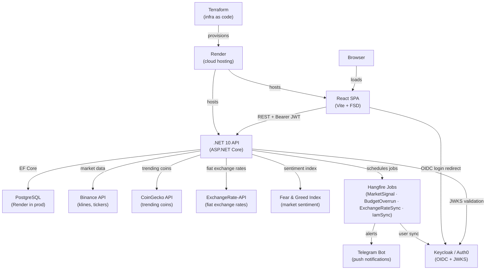

# FinTrackPro — Architecture

## Overview

Clean Architecture with CQRS. Dependencies point inward — outer layers depend on inner layers, never the reverse.

```
[ API / BackgroundJobs ]
         ↓
    [ Application ]
         ↓
       [ Domain ]
         ↑
  [ Infrastructure ]  (implements interfaces defined in Domain/Application)
```

## System Context



## Layer Responsibilities

### Domain (`FinTrackPro.Domain`)
- Entities, enums, domain exceptions
- Repository interfaces (`IUserRepository`, etc.)
- Zero external dependencies

### Application (`FinTrackPro.Application`)
- CQRS commands and queries via MediatR — feature groups: `Finance/`, `Trading/`, `Notifications/`, `Subscription/`
- FluentValidation validators
- Service interfaces:
  - `ICurrentUser` — resolved user identity (`UserId`, `IsAdmin`)
  - `IIdentityService`, `INotificationService`, `IBinanceService`, `IExchangeRateService`, etc.
  - `ISubscriptionLimitService` — enforces per-plan feature limits; throws `PlanLimitExceededException` (→ HTTP 402)
  - `IPaymentGatewayService` — provider-neutral checkout / portal / customer creation
  - `IPaymentWebhookHandler` — provider-neutral webhook processing; accepts raw payload + headers dict
- Strongly-typed options: `SubscriptionPlanOptions` (limits per tier), `PaymentGatewayOptions` (provider + price ID)
- DTOs (explicit `operator` conversions, no AutoMapper)
- Pipeline behaviors: `ValidationBehavior` → `LoggingBehavior`

### Infrastructure (`FinTrackPro.Infrastructure`)
- EF Core `ApplicationDbContext` + entity configurations
- Repository implementations
- External services: `BinanceService`, `FearGreedService`, `CoinGeckoService`, `CoinGeckoExchangeRateService`
- `TelegramNotificationChannel`, `NotificationService`
- `UserContextMiddleware` — resolves and provisions the local `AppUser` once per authenticated request; stores result in `HttpContext.Items`
- `IdentityService` — fast path (existing `UserIdentity`) + slow path (create or link); handles concurrent first-login races via `DbUpdateException` retry
- `CurrentUserAccessor` (`ICurrentUser`) — reads resolved user from `HttpContext.Items`; injected into Application handlers
- **IAM provider abstraction** — selected at startup via `IdentityProvider:Provider` config key:
  - `KeycloakClaimsTransformer` — flattens `realm_access.roles` into `ClaimTypes.Role` claims
  - `Auth0ClaimsTransformer` — reads `https://fintrackpro.dev/roles` custom claim (set by Auth0 post-login Action)
  - `KeycloakAdminService` (`IIamProviderService`) — calls Keycloak Admin REST API via client-credentials
  - `Auth0ManagementService` (`IIamProviderService`) — calls Auth0 Management API v2 via client-credentials
- **Payment gateway abstraction** — selected at startup via `PaymentGateway:Provider` config key (same pattern as IAM):
  - `StripePaymentGatewayService` (`IPaymentGatewayService`) — Stripe.net v51 wrapper for customer, checkout, portal
  - `StripeWebhookHandler` (`IPaymentWebhookHandler`) — Stripe-specific signature verification + event dispatch; all Stripe header names isolated here
  - `SubscriptionLimitService` (`ISubscriptionLimitService`) — admin bypass + `-1` sentinel; reads `SubscriptionPlanOptions` from config
- `IMemoryCache` for external API responses
- **Cancellation semantics** — all infrastructure services let `OperationCanceledException` propagate
  (via `catch (Exception ex) when (ex is not OperationCanceledException)`). This ensures Hangfire
  shutdown tokens held by background jobs (e.g., `MarketSignalJob`) can cancel in-flight work cleanly.
  Non-cancellation exceptions are caught, logged, and suppressed at the service boundary.

### API (`FinTrackPro.API`)
- Thin controllers — delegate to `Mediator.Send()`
- `ExceptionHandlingMiddleware` maps exceptions to RFC 7807 Problem Details responses (400, 403, 404, 409, 500)
- JWT Bearer authentication — provider-conditional: Keycloak (Authority + MetadataAddress) or Auth0 (Authority only)
- Hangfire dashboard + recurring job registration
- Scalar API UI (`/scalar`)
- CORS policy for SPA

### BackgroundJobs (`FinTrackPro.BackgroundJobs`)
- `MarketSignalJob` — every 4h: RSI + volume spike signals via Skender + Binance
- `BudgetOverrunJob` — daily: checks category spending vs budget limits; all comparisons normalised to USD via stored `RateToUsd`
- `ExchangeRateSyncJob` — every 8h (Hangfire): fetches fiat rates from ExchangeRate-API v6 (`latest/USD`) and populates `IMemoryCache`
- `IamUserSyncJob` — daily: diffs active IAM provider users against `AppUser` table; deactivates rows for deleted or disabled accounts

See [background-jobs.md](background-jobs.md) for detailed sequence diagrams of each job.

## Frontend Architecture (FSD)

Feature-Sliced Design — layers import only downward.

```
app → pages → widgets → features → entities → shared
```

| Layer | Contents |
|---|---|
| `app/` | QueryProvider, AuthProvider, LocaleProvider, BrowserRouter + Outlet layout, global CSS, i18n initialization; mounts `<PlanLimitModal />` globally |
| `pages/` | DashboardPage, TransactionsPage, BudgetsPage, TradesPage, SettingsPage, PricingPage — all translated via `useTranslation()`, amounts converted via `convertAmount()` + `formatCurrency()` |
| `widgets/` | Navbar (translated links + LocaleSettingsDropdown + PlanBadge in user dropdown), FearGreedWidget, SignalsList, TrendingCoinsWidget |
| `features/` | AddTransactionForm, AddTradeForm, EditTradeModal, AddBudgetForm (all include currency selector), NotificationSettingsForm (disabled overlay for Free users), WatchlistManager, authStore (Zustand), localeStore (Zustand + persist — `language`, `currency`), `upgrade/` (planLimitStore, PlanLimitModal, UpgradeButton, SubscriptionSection), `plan-badge/` (PlanBadge pill) |
| `entities/` | transaction, trade, signal, budget, watched-symbol, notification-preference, exchange-rate, user-preferences, subscription — types + React Query hooks |
| `shared/` | Axios client (Bearer injection + 402 interceptor → planLimitStore + redirect on 401), `auth/` adapter (Keycloak or Auth0), env config, `cn()`, `formatCurrency()`, `convertAmount()`, `FreePlanAdBanner`, i18n resources (en/vi) |

### Responsive Design

The frontend uses a mobile-first approach with TailwindCSS v4 breakpoints:

- `md` (768px) is the primary layout threshold — navigation switches from hamburger drawer to desktop links, and multi-column page layouts activate
- `sm` (640px) adapts form grids and stat cards (e.g. `grid-cols-1 sm:grid-cols-3`)
- Spacing scales from `p-4` (mobile) to `p-6` (md+)
- Tables use a `-mx-4 sm:mx-0` bleed pattern on mobile

All pages (Dashboard, Transactions, Budgets, Trades, Settings) follow the same responsive patterns.

## Key Design Decisions

| Decision | Choice | Reason |
|---|---|---|
| ORM | EF Core 10 + SQL Server (local Docker) / PostgreSQL (Render production) | Provider-agnostic migrations; active provider selected via `DatabaseProvider:Provider` config key |
| CQRS | MediatR 12 | Decoupled handlers, pipeline behaviors |
| Validation | FluentValidation 11 | Declarative, auto-wired via DI |
| Auth | Keycloak / Auth0 + JWT Bearer | Swappable IAM providers via `IdentityProvider:Provider` config. Roles (`User`/`Admin`) live in the IAM provider only; the active claims transformer maps them to ASP.NET Core `ClaimTypes.Role`. Identity linking via `UserIdentity` join table (`ExternalUserId` + `Provider`); one `AppUser` can have identities from multiple providers. Profile synced on every login via `UserContextMiddleware`; orphans are soft-deleted nightly by `IamUserSyncJob`. |
| Background jobs | Hangfire + provider-matched storage (PostgreSQL in prod, SQL Server locally) | Persistent job history, retry policy |
| Indicators | Skender.Stock.Indicators | Free, NuGet, covers RSI/EMA/BB |
| Notifications | Telegram Bot | No cost, no email infra |
| Caching | IMemoryCache (in-process) | Single instance — swap to Redis when scaling |
| API docs | Scalar + .NET 10 built-in OpenAPI | Swashbuckle incompatible with .NET 10 |
| Frontend state | React Query (server) + Zustand (client) | Clear separation of concerns |
| Responsive design | TailwindCSS v4 breakpoints — mobile-first (`sm`/`md`/`lg`) | Progressive enhancement; `md` (768px) is the primary nav and layout threshold |

## Infrastructure

### Terraform (`infra/terraform/`)

Render services are managed as code using the official `render-oss/render` Terraform provider.
State is stored in **Terraform Cloud** (free tier). See [render-deploy.md](../guides/render-deploy.md) for the full deploy guide.

| Resource | Type | Description |
|---|---|---|
| `render_project.fintrackpro` | Project | Groups all services under the `fintrackpro` project with a `Production` environment |
| `render_postgres.db` | PostgreSQL Database | Free-tier PostgreSQL 18, Oregon — lifecycle-guarded (never updated/destroyed by Terraform) |
| `render_web_service.api` | Docker Web Service | .NET 10 API — free plan, Oregon region |
| `render_static_site.frontend` | Static Site | React/Vite SPA — CDN-distributed globally |

All secrets are stored as sensitive Terraform Cloud workspace variables — never committed to source.
See [infra/terraform/variables.tf](../infra/terraform/variables.tf) for the full variable list and
[infra/terraform/terraform.tfvars.example](../infra/terraform/terraform.tfvars.example) for a safe example.

### render.yaml

The `render.yaml` Blueprint at the repo root is retained as a **fallback** for manual one-click Render dashboard deploys. Terraform is the authoritative deployment tool.

## Test Projects

| Project | Layer | Type |
|---|---|---|
| `FinTrackPro.Domain.UnitTests` | Domain | Pure unit — no mocks needed |
| `FinTrackPro.Application.UnitTests` | Application | NSubstitute for repositories |
| `FinTrackPro.Infrastructure.UnitTests` | Infrastructure | NSubstitute + `MockHttpMessageHandler` for typed `HttpClient` |
| `FinTrackPro.Api.IntegrationTests` | API | Testcontainers (SQL Server), `WebApplicationFactory`, real EF Core — uses SQL Server provider locally |

## Related Architecture Docs

- [auth.md](auth.md) — IAM provider overview, auth flows, and provider switching reference
- [api-spec.md](api-spec.md) — REST endpoints and schemas
- [database.md](database.md) — schema, tables, relationships
- [background-jobs.md](background-jobs.md) — Hangfire job details and sequence diagrams
- [ui-flows.md](ui-flows.md) — frontend user flows
