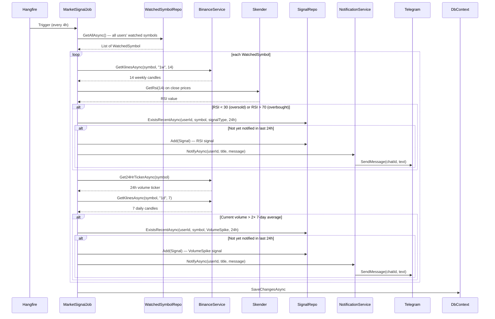
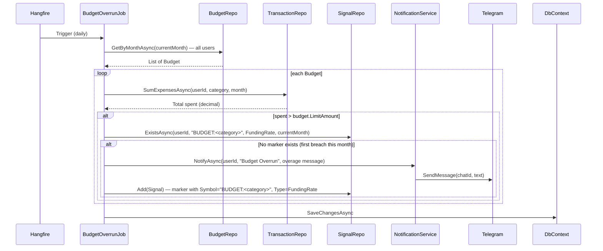

# Background Jobs

FinTrackPro runs three Hangfire recurring jobs. All jobs are registered in `Program.cs` and use SQL Server as the Hangfire storage backend.

| Job | Schedule | Purpose |
|---|---|---|
| `MarketSignalJob` | Every 4 hours | RSI + volume spike signals for watched symbols |
| `BudgetOverrunJob` | Daily | Detect and alert on budget limit breaches |
| `IamUserSyncJob` | Daily | Deactivate local users deleted from IAM provider |

The Hangfire dashboard is available at `/hangfire` (requires `Admin` role).

---

## MarketSignalJob

Runs every 4 hours. Iterates all `WatchedSymbol` rows across all users, computes RSI via Skender and checks for volume spikes via Binance, then sends Telegram notifications on first detection (24h dedup).

**Key details:**
- Signal dedup window: 24 hours per `(UserId, Symbol, SignalType)` triple
- RSI computed on 14 weekly candles (1W timeframe)
- Volume spike threshold: 2× the 6-day average daily volume
- Errors per symbol are caught and logged; job continues to next symbol

---

## BudgetOverrunJob

Runs daily. For each budget in the current month, sums the user's expenses in that category. If spending exceeds the limit and no alert has been sent yet this month, it sends one Telegram notification and records a marker `Signal` to prevent duplicate alerts.

**Key details:**
- Alert fires only once per `(UserId, Category, Month)` — first breach only
- Marker signal uses `SignalType.FundingRate` as a workaround (no dedicated `BudgetOverrun` type yet)
- `Symbol` field stores `"BUDGET:<category>"` to namespace budget markers from market signals

---

## IamUserSyncJob

Runs daily. Calls the active IAM provider's admin API to get the current list of active users, then deactivates any local `AppUser` rows whose `ExternalUserId` is no longer present. Includes a safety guard: if the IAM returns zero users (possible API error), no deactivations occur.

See the [auth-setup.md](auth-setup.md#nightly-iam-user-sync) sequence diagram for this job's flow.
