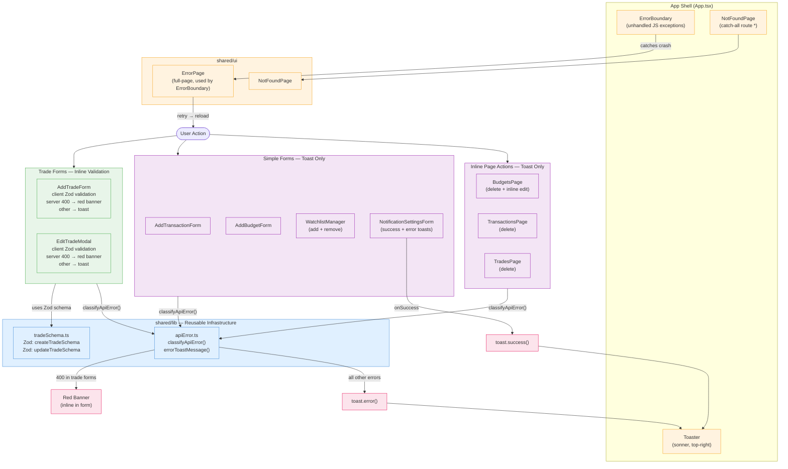

# Frontend Error Handling & Form Validation Plan

## Context

The app has inconsistent, incomplete error handling across all pages and features:

| Location | Current state |
|---|---|
| `AddTradeForm` | Shows raw `(error as Error).message` — "Request failed with status code 400" |
| `EditTradeModal` | Same raw error message |
| `WatchlistManager` | Shows raw `addError?.message`; remove has no error handling |
| `AddTransactionForm` | No `error` state destructured at all — silent failure |
| `AddBudgetForm` | No error handling |
| `BudgetsPage` (inline edit / delete) | No error handling |
| `NotificationSettingsForm` | Shows `isSuccess` green text inline; no error handling |
| `DashboardPage` (queries) | No error states shown |
| App-level | No Error Boundary, no 404 route, no toast provider |

**Goal:** Build one reusable error handling layer — `classifyApiError` + toast — and apply it consistently to every form and mutation in the app. Add Error Boundary and 404 for defensive completeness.

---

## Phase 1 — Install Toast Library

**Package:** `sonner` — lightweight (no deps), React 19-compatible, `richColors` gives semantic red/green/yellow out of the box.

```bash
cd frontend/fintrackpro-ui
npm install sonner
```

---

## Phase 2 — New Shared Infrastructure

### A. `src/shared/lib/tradeSchema.ts`
Zod schema mirroring both `CreateTradeCommandValidator` and `UpdateTradeCommandValidator`. Lives in `shared/lib/` so both feature layers can import it under FSD.

```ts
import { z } from 'zod'

// Mirrors backend regex: uppercase letters/digits, optional / or - separator.
// Valid: BTCUSDT, AAPL, EUR/USD, BTC-USDT, VIC
const symbolRegex = /^[A-Z0-9]{1,10}([/\-][A-Z0-9]{1,10})?$/

const baseSchema = z.object({
  symbol: z
    .string()
    .min(1, 'Symbol is required')
    .max(20, 'Symbol must be 20 characters or fewer')
    .regex(symbolRegex, 'Symbol must be uppercase letters/digits (e.g. BTCUSDT, AAPL, EUR/USD)'),
  direction: z.enum(['Long', 'Short']),
  entryPrice:   z.number({ invalid_type_error: 'Entry price is required'   }).positive('Entry price must be greater than zero'),
  exitPrice:    z.number({ invalid_type_error: 'Exit price is required'    }).positive('Exit price must be greater than zero'),
  positionSize: z.number({ invalid_type_error: 'Position size is required' }).positive('Position size must be greater than zero'),
  fees:         z.number({ invalid_type_error: 'Fees must be a number'     }).min(0, 'Fees cannot be negative'),
  notes: z.string().max(1000, 'Notes must be 1000 characters or fewer').nullable(),
})

export const createTradeSchema = baseSchema
export const updateTradeSchema = baseSchema
export type CreateTradeInput = z.infer<typeof createTradeSchema>
export type UpdateTradeInput  = z.infer<typeof updateTradeSchema>
```

`z.number()` requires a native number — the forms already call `parseFloat()`, so `NaN` from blank fields triggers the `invalid_type_error` messages (e.g. "Entry price is required").

---

### B. `src/shared/lib/apiError.ts`
Generic error classifier + toast message helper. **Not trade-specific** — every feature in the app reuses this.

```ts
import { isAxiosError } from 'axios'

export interface ProblemDetails {
  title?: string
  detail?: string
  errors?: Record<string, string[]>   // FluentValidation field errors map
}

export type ApiErrorKind =
  | { type: 'validation';  details: ProblemDetails }  // 400 w/ Problem Details
  | { type: 'forbidden' }                              // 403
  | { type: 'not_found' }                              // 404
  | { type: 'conflict';    message: string }           // 409
  | { type: 'server_error' }                           // 5xx
  | { type: 'network' }                                // no response
  | { type: 'unknown';     message: string }

export function classifyApiError(error: unknown): ApiErrorKind {
  if (!isAxiosError(error)) return { type: 'unknown', message: String(error) }
  if (!error.response)      return { type: 'network' }

  const { status, data } = error.response
  if (status === 400) return { type: 'validation',  details: data as ProblemDetails }
  if (status === 403) return { type: 'forbidden' }
  if (status === 404) return { type: 'not_found' }
  if (status === 409) return { type: 'conflict', message: (data as ProblemDetails)?.detail ?? 'Conflict.' }
  if (status >= 500)  return { type: 'server_error' }
  return { type: 'unknown', message: (error as Error).message }
}

/** One-line human-readable message suitable for toast notifications */
export function errorToastMessage(error: unknown): string {
  const kind = classifyApiError(error)
  switch (kind.type) {
    case 'validation':   return kind.details.title ?? 'Please fix the highlighted fields.'
    case 'forbidden':    return "You don't have permission to do that."
    case 'not_found':    return 'The resource was not found.'
    case 'conflict':     return kind.message
    case 'server_error': return 'A server error occurred. Please try again later.'
    case 'network':      return 'Network error. Check your connection.'
    default:             return 'Something went wrong.'
  }
}
```

---

### C. `src/shared/ui/ErrorPage.tsx`
Full-page error component — used by ErrorBoundary and optionally by query error states.

```tsx
interface ErrorPageProps {
  title?: string
  message?: string
  onRetry?: () => void
}

export function ErrorPage({ title = 'Something went wrong', message, onRetry }: ErrorPageProps) {
  return (
    <div className="flex flex-col items-center justify-center min-h-[60vh] gap-4 text-center px-4">
      <div className="text-5xl text-gray-300">⚠</div>
      <h1 className="text-2xl font-semibold text-gray-800">{title}</h1>
      {message && <p className="text-gray-500 max-w-md">{message}</p>}
      <div className="flex gap-3">
        {onRetry && (
          <button onClick={onRetry}
            className="rounded-md bg-blue-600 px-4 py-2 text-sm text-white hover:bg-blue-700">
            Try again
          </button>
        )}
        <a href="/dashboard"
          className="rounded-md border px-4 py-2 text-sm text-gray-600 hover:bg-gray-50">
          Go to Dashboard
        </a>
      </div>
    </div>
  )
}
```

---

### D. `src/shared/ui/NotFoundPage.tsx`
404 fallback — rendered by the catch-all route.

```tsx
export function NotFoundPage() {
  return (
    <div className="flex flex-col items-center justify-center min-h-[60vh] gap-4 text-center px-4">
      <div className="text-6xl font-black text-gray-200">404</div>
      <h1 className="text-2xl font-semibold text-gray-800">Page not found</h1>
      <p className="text-gray-500">The page you're looking for doesn't exist.</p>
      <a href="/dashboard"
        className="rounded-md bg-blue-600 px-4 py-2 text-sm text-white hover:bg-blue-700">
        Go to Dashboard
      </a>
    </div>
  )
}
```

---

### E. `src/app/providers/ErrorBoundary.tsx`
React class-based Error Boundary. Catches any unhandled JS exception in the component tree and shows `ErrorPage` with a page-reload retry.

```tsx
import { Component, type ReactNode } from 'react'
import { ErrorPage } from '@/shared/ui/ErrorPage'

interface State { hasError: boolean }

export class ErrorBoundary extends Component<{ children: ReactNode }, State> {
  state: State = { hasError: false }
  static getDerivedStateFromError(): State { return { hasError: true } }
  render() {
    if (this.state.hasError) {
      return (
        <ErrorPage
          title="Unexpected error"
          message="An unexpected error occurred. Refresh the page or return to Dashboard."
          onRetry={() => { this.setState({ hasError: false }); window.location.reload() }}
        />
      )
    }
    return this.props.children
  }
}
```

---

## Phase 3 — App-Level Wiring

### F. `src/app/App.tsx` — three additions

1. **Wrap** entire tree with `<ErrorBoundary>` (outermost)
2. **Add** `<Toaster position="top-right" richColors />` inside `<QueryProvider>` — renders Sonner's toast container
3. **Add** catch-all route: `<Route path="*" element={<NotFoundPage />} />`

```tsx
// Diff sketch
+ import { ErrorBoundary } from './providers/ErrorBoundary'
+ import { Toaster } from 'sonner'
+ import { NotFoundPage } from '@/shared/ui/NotFoundPage'

export function App() {
  return (
+   <ErrorBoundary>
      <AuthProvider>
        <QueryProvider>
+         <Toaster position="top-right" richColors />
          <BrowserRouter>
            <Routes>
              <Route element={<AppLayout />}>
                ...existing routes...
+               <Route path="*" element={<NotFoundPage />} />
              </Route>
            </Routes>
          </BrowserRouter>
        </QueryProvider>
      </AuthProvider>
+   </ErrorBoundary>
  )
}
```

---

## Phase 4 — Feature & Page Updates

### Error handling decision per location

| Mutation/Context | 400 | Other errors (403/409/5xx/network) |
|---|---|---|
| **Form with validation** (AddTrade, EditTrade) | Inline field errors + server message banner | `toast.error(...)` |
| **Simple form** (AddTransaction, AddBudget, WatchlistManager, NotificationSettings) | `toast.error(...)` | `toast.error(...)` |
| **Inline action** (delete trade, delete tx, delete budget, remove symbol) | `toast.error(...)` | `toast.error(...)` |
| **Inline edit** (budget limit update) | `toast.error(...)` | `toast.error(...)` |
| **Query (read) errors** | N/A | Show inline empty/error state in the list |

Rationale: Only the trade forms have server-side field-level validation worth surfacing inline. All other mutations have simple server rules (required fields covered by HTML5 `required`, numeric range covered by `type="number"`) where a toast is sufficient and less disruptive.

---

### G. `features/add-trade/ui/AddTradeForm.tsx`

**Full changes:**
1. Add `fieldErrors: Partial<Record<string, string>>` and `serverErrors: ProblemDetails | null` state
2. `handleSubmit`:
   - Build `raw` object with `parseFloat()` calls
   - `createTradeSchema.safeParse(raw)` → map Zod issues to `fieldErrors` → return early on failure
   - `mutate(result.data, { onSuccess, onError })`
   - `onSuccess`: reset form (fixes race condition — was reset before mutation completed)
   - `onError`: `classifyApiError` — if `validation` → set `serverErrors`; else `toast.error(errorToastMessage(err))`
3. `validateField(field, value)` helper using `createTradeSchema.shape[field as keyof ...].safeParse()`
4. Each `onChange` clears its field's error; each input `onBlur` calls `validateField`
5. Each input wrapped in `<div className="flex flex-col gap-1">` with conditional `border-red-400` via `cn()` and `<p className="text-xs text-red-600">` error message beneath
6. Replace `{error && <p>(error as Error).message</p>}` with structured server-error banner:

```tsx
{serverErrors && (
  <div className="rounded-md border border-red-200 bg-red-50 px-3 py-2 text-sm text-red-700">
    <p className="font-medium">{serverErrors.title ?? 'Validation failed'}</p>
    {serverErrors.errors && (
      <ul className="mt-1 list-disc list-inside space-y-0.5">
        {Object.entries(serverErrors.errors).flatMap(([, msgs]) =>
          msgs.map((m, i) => <li key={i}>{m}</li>)
        )}
      </ul>
    )}
  </div>
)}
```

---

### H. `features/edit-trade/ui/EditTradeModal.tsx`

Same changes as AddTradeForm, plus:
- Uses `updateTradeSchema`
- Adds `onError` to the existing `mutate({ onSuccess: onClose })` call-site
- Clears `fieldErrors` and `serverErrors` in `useEffect` when `trade` prop changes (prevents stale errors on re-open)
- Notes textarea: `onBlur={() => validateField('notes', notes || null)}`

---

### I. `features/add-transaction/ui/AddTransactionForm.tsx`

**Current state:** No `error` destructured, no error display, silent failures.

**Changes:**
- Destructure `error` from `useCreateTransaction()`
- Add `onError` callback to `mutate()`: `toast.error(errorToastMessage(error))`
- Move form reset into `onSuccess` callback (same race condition fix as AddTradeForm)

---

### J. `features/add-budget/ui/AddBudgetForm.tsx`

**Current state:** No error handling. `mutate` has `onSuccess` but no `onError`.

**Changes:**
- Add `onError` to `mutate()` call: `toast.error(errorToastMessage(error))`

---

### K. `features/manage-watchlist/ui/WatchlistManager.tsx`

**Current state:** Shows raw `addError?.message`; remove has no error handling.

**Changes:**
- Remove `error: addError` destructure + `{addError && <p>...}` inline error
- Add `onError` to `add()` call: `toast.error(errorToastMessage(err))`
- Add `onError` to `remove()` call: `toast.error(errorToastMessage(err))`

---

### L. `features/notification-settings/ui/NotificationSettingsForm.tsx`

**Current state:** Shows `isSuccess` inline green text; no error handling.

**Changes:**
- Remove `isSuccess` from destructure + the inline `{isSuccess && <p>Preferences saved.</p>}`
- Add `onSuccess` callback to `mutate()`: `toast.success('Preferences saved.')`
- Add `onError` callback: `toast.error(errorToastMessage(err))`

This is a pattern upgrade: use toast for both success and error feedback rather than mixing inline and silent patterns.

---

### M. `pages/budgets/ui/BudgetsPage.tsx`

**Current state:** `deleteBudget` and `updateBudget` have no error handling.

**Changes:**
- Add `onError` to `deleteBudget()` call-site: `toast.error(errorToastMessage(err))`
- `commitEdit`: add `onError` to `updateBudget()` call-site: `toast.error(errorToastMessage(err))`

---

### N. `pages/transactions/ui/TransactionsPage.tsx`

**Current state:** `deleteTx` has no error handling.

**Changes:**
- Add `onError` to `deleteTx()` call-site: `toast.error(errorToastMessage(err))`

---

### O. `pages/trades/ui/TradesPage.tsx`

**Current state:** `deleteTrade` has no error handling.

**Changes:**
- Add `onError` to `deleteTrade()` call-site: `toast.error(errorToastMessage(err))`

---

## Error Handling Matrix (Complete)

| Scenario | Pattern | Location |
|---|---|---|
| Trade form: client-side field invalid | Inline error under each field, red border | In form |
| Trade form: server 400 (FluentValidation) | Red banner listing server messages | In form |
| Any mutation: 403 Forbidden | `toast.error("You don't have permission...")` | Toast top-right |
| Any mutation: 404 Not Found | `toast.error("The resource was not found.")` | Toast top-right |
| Any mutation: 409 Conflict | `toast.error(conflict message from server)` | Toast top-right |
| Any mutation: 5xx | `toast.error("A server error occurred...")` | Toast top-right |
| Any mutation: network | `toast.error("Network error. Check your connection.")` | Toast top-right |
| Simple form 400 | `toast.error(...)` | Toast top-right |
| Notification settings: save success | `toast.success("Preferences saved.")` | Toast top-right |
| Unhandled JS exception | ErrorPage with retry + dashboard link | Full page |
| Unknown URL (/anything) | NotFoundPage with dashboard link | Full page |

---

## Files Changed Summary

| File | Action | Why |
|---|---|---|
| `shared/lib/tradeSchema.ts` | **Create** | Zod schema mirroring backend validators |
| `shared/lib/apiError.ts` | **Create** | Generic error classification + toast message helper |
| `shared/ui/ErrorPage.tsx` | **Create** | Full-page error UI with retry |
| `shared/ui/NotFoundPage.tsx` | **Create** | 404 page with dashboard navigation |
| `app/providers/ErrorBoundary.tsx` | **Create** | React Error Boundary for unhandled JS exceptions |
| `app/App.tsx` | **Modify** | Add ErrorBoundary, Toaster, 404 route |
| `features/add-trade/ui/AddTradeForm.tsx` | **Modify** | Client validation + inline errors + error routing |
| `features/edit-trade/ui/EditTradeModal.tsx` | **Modify** | Client validation + inline errors + error routing |
| `features/add-transaction/ui/AddTransactionForm.tsx` | **Modify** | Add error handling, fix race condition |
| `features/add-budget/ui/AddBudgetForm.tsx` | **Modify** | Add error handling |
| `features/manage-watchlist/ui/WatchlistManager.tsx` | **Modify** | Replace raw error text with toast |
| `features/notification-settings/ui/NotificationSettingsForm.tsx` | **Modify** | Replace inline success with toast; add error |
| `pages/budgets/ui/BudgetsPage.tsx` | **Modify** | Add error handling to delete + inline edit |
| `pages/transactions/ui/TransactionsPage.tsx` | **Modify** | Add error handling to delete |
| `pages/trades/ui/TradesPage.tsx` | **Modify** | Add error handling to delete |

No changes to any entity API files (`tradeApi.ts`, etc.) or backend files.

---

## Consistency Rules Applied

1. **All mutations get `onError`** — no silent failures anywhere
2. **Form resets move to `onSuccess`** — no race conditions
3. **No raw `.message` strings displayed** — all errors go through `errorToastMessage`
4. **Success feedback** via toast only (removes mixed inline-green/toast pattern from NotificationSettingsForm)
5. **400 with field errors** → inline banner in form (trade forms only; others use toast)
6. **Every other error** → `toast.error()`

---

## Architecture Diagram



---

## Verification Checklist

1. Type `SDFS$#$` as symbol → red border + "Symbol must be uppercase..." inline error on blur; submit blocked
2. Leave Entry price blank → "Entry price is required" under field on blur; submit blocked
3. Valid trade form → logs trade, form resets **only after** server confirms (race condition fixed)
4. Server returns 400 on trade form → red banner lists server FluentValidation messages
5. Simulate 403 or 5xx on any mutation → `toast.error(...)` appears top-right
6. Delete a trade/transaction/budget → error shows as toast if it fails
7. Save notification preferences → `toast.success("Preferences saved.")` replaces inline green text
8. Navigate to `/nonexistent` → NotFoundPage with "Go to Dashboard"
9. Throw unhandled JS error → ErrorBoundary catches; ErrorPage shown with retry
10. Re-open Edit Trade modal for different trade → no stale field errors from previous open
11. Type 1001 chars in notes → "Notes must be 1000 characters or fewer" inline error on blur
