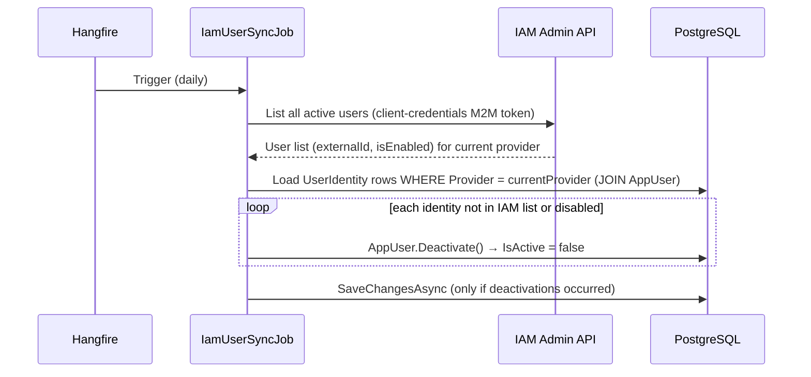

# Identity Linking Flow Refactor Plan

## Context

`EnsureUserBehavior` currently runs on **every MediatR request**, causing a DB lookup (and possible insert) before each handler executes. Beyond performance, it has deeper design problems:

1. **Single-identity model** — `AppUser.ExternalUserId` + `AppUser.Provider` are flat columns with a unique index only on `ExternalUserId`. Two providers could theoretically share a `sub`, and linking one email across multiple providers is impossible.
2. **Provider read from config, not JWT** — `ICurrentUserService.ProviderName` reads `IdentityProvider:Provider` from configuration instead of the JWT `iss` claim, so the stored provider name is config-driven rather than token-driven.
3. **Wrong layer for identity resolution** — a MediatR pipeline behavior should not own DB user provisioning; that is an infrastructure/identity concern.
4. **Every handler re-queries the user** — all handlers call `userRepository.GetByExternalIdAsync(currentUser.ExternalUserId!)` after `EnsureUserBehavior` already did the same lookup, resulting in two round-trips per request.

The plan moves user resolution to `UserContextMiddleware` (runs once per HTTP request, before MediatR), introduces a proper `UserIdentity` join-table for multi-provider linking, and lets handlers consume a lean `ICurrentUser` that exposes only the resolved DB `UserId`.

---

## Architecture After Refactor

```
HTTP Request
   ↓
JWT Authentication (validated)
   ↓
UserContextMiddleware  ← resolve & provision user here (one DB call per request)
   ↓
ICurrentUser.UserId   ← available in HttpContext.Items
   ↓
MediatR Handler       ← inject ICurrentUser, call GetByIdAsync once
   ↓
UnitOfWork / SaveChanges
```

---

## Files to Create

| File | Purpose |
|---|---|
| `Domain/Entities/UserIdentity.cs` | New entity: `(ExternalUserId, Provider)` → `AppUser` |
| `Application/Common/Interfaces/ICurrentUser.cs` | `Guid UserId { get; }` — replaces `ICurrentUserService` |
| `Application/Common/Models/CurrentUser.cs` | `record CurrentUser(Guid UserId)` + `From(AppUser)` factory |
| `Application/Common/Interfaces/IIdentityService.cs` | `Task<CurrentUser> ResolveAsync(ClaimsPrincipal, CancellationToken)` |
| `Domain/Repositories/IUserIdentityRepository.cs` | `GetAsync(externalId, provider, ct)` |
| `Infrastructure/Identity/IdentityService.cs` | Resolution + upsert logic |
| `Infrastructure/Identity/UserContextMiddleware.cs` | Calls `IdentityService.ResolveAsync`, stores in `HttpContext.Items` |
| `Infrastructure/Identity/ClaimsExtensions.cs` | `GetExternalId()`, `GetProvider()`, `GetEmail()`, `IsEmailVerified()` |
| `Infrastructure/Persistence/Repositories/UserIdentityRepository.cs` | EF Core impl |
| `Infrastructure/Persistence/Configurations/UserIdentityConfiguration.cs` | Composite unique index `(ExternalUserId, Provider)` |

## Files to Modify

| File | Change |
|---|---|
| `Domain/Entities/AppUser.cs` | Remove `ExternalUserId`, `Provider`. Add `_identities` list + `Identities` + `AddIdentity()`. Simplify `Create(email, displayName)`. Replace `SyncIdentity(exId, email, name, provider)` with `UpdateProfile(email, name)`. |
| `Infrastructure/Persistence/Configurations/AppUserConfiguration.cs` | Remove `ExternalUserId`/`Provider` property configs + their unique indexes. |
| `Infrastructure/Persistence/ApplicationDbContext.cs` | Add `DbSet<UserIdentity> UserIdentities`. |
| `Application/Common/Behaviors/EnsureUserBehavior.cs` | **Delete** |
| `Application/DependencyInjection.cs` | Remove `EnsureUserBehavior` from pipeline. |
| `Infrastructure/DependencyInjection.cs` | Register `IIdentityService`, `IUserIdentityRepository`, `ICurrentUser`/`CurrentUserAccessor`. Remove `ICurrentUserService`/`CurrentUserService`. |
| `API/Program.cs` | Add `app.UseMiddleware<UserContextMiddleware>()` after `app.UseAuthentication()`. |
| `BackgroundJobs/Jobs/IamUserSyncJob.cs` | Query `UserIdentities` by current provider instead of `AppUser.ExternalUserId`. |
| All ~12 handler files | Replace `ICurrentUserService` → `ICurrentUser`; replace `GetByExternalIdAsync(externalId)` → `GetByIdAsync(currentUser.UserId)`. |
| All handler test files | Update mocks from `ICurrentUserService` to `ICurrentUser`. |
| `docs/auth-setup.md` | Replace both Mermaid diagrams (auth flow + nightly sync) to reflect middleware-based resolution and `UserIdentity` table. Add reactivation note. |
| `docs/database.md` | Remove `ExternalUserId`/`Provider` from Users table; add new `UserIdentities` table schema. |
| `docs/architecture.md` | Remove `EnsureUserBehavior` from pipeline description; update Auth tech-stack row. |
| `docs/background-jobs.md` | Update `IamUserSyncJob` description to reference `UserIdentity` query. |
| `backend/CLAUDE.md` | Remove `EnsureUserBehavior` from pipeline list; update "Current User" section to `ICurrentUser`. |

---

## Key Implementation Details

### UserIdentity entity

```csharp
public class UserIdentity
{
    public Guid Id { get; private set; }
    public string ExternalUserId { get; private set; }
    public string Provider { get; private set; }
    public Guid UserId { get; private set; }
    public AppUser User { get; private set; } = null!;

    private UserIdentity() { }

    public UserIdentity(string externalUserId, string provider, Guid userId)
    {
        Id = Guid.NewGuid();
        ExternalUserId = externalUserId;
        Provider = provider;
        UserId = userId;
    }
}
```

### AppUser changes

```csharp
// Remove: ExternalUserId, Provider, SyncIdentity(exId, email, name, provider)
// Add:
private readonly List<UserIdentity> _identities = new();
public IReadOnlyCollection<UserIdentity> Identities => _identities.AsReadOnly();

public static AppUser Create(string? email, string displayName) { ... }

public void AddIdentity(string externalId, string provider)
{
    if (_identities.Any(x => x.ExternalUserId == externalId && x.Provider == provider))
        return;
    _identities.Add(new UserIdentity(externalId, provider, Id));
}
```

### IdentityService.ResolveAsync — resolution logic

**Fast path (returning user — UserIdentity exists):**
1. Look up `UserIdentity` by `(externalId, provider)`.
2. Call `user.UpdateProfile(email, displayName)` — updates fields + reactivates if `IsActive == false`.
3. Save only if something changed (method returns `bool`).
4. Return `CurrentUser.From(identity.User)`.

**Slow path (new user or new provider link):**
1. If email is present and verified → look up `AppUser` by email.
   - If found: call `user.AddIdentity(externalId, provider)` (link new provider to existing account).
2. If still no user: `AppUser.Create(email, displayName)` + `AddIdentity` + `userRepo.Add(user)`.
3. `SaveChangesAsync` in a try/catch — on unique-constraint race (concurrent first login): re-query and return the winner.

### AppUser.UpdateProfile — replaces SyncIdentity

```csharp
// Returns true if anything changed (email, displayName, or reactivation)
public bool UpdateProfile(string? email, string displayName)
{
    var normEmail = email?.Trim().ToLowerInvariant() ?? Email;
    var normName  = displayName.Trim();
    var changed   = Email != normEmail || DisplayName != normName || !IsActive;

    Email       = normEmail;
    DisplayName = normName;
    IsActive    = true;   // reactivate if nightly job had deactivated them

    return changed;
}
```

### ClaimsExtensions — provider from `iss` claim

```csharp
public static string GetProvider(this ClaimsPrincipal user)
    => user.FindFirst("iss")?.Value
       ?? throw new InvalidOperationException("JWT is missing 'iss' claim");
```

This replaces the config-driven `ProviderName` from `ICurrentUserService`.

### IamUserSyncJob update

After the refactor, `AppUser` no longer has `ExternalUserId`. The job needs to:
1. Get all IAM users from the current provider (unchanged).
2. Load all `UserIdentity` rows filtered by the current provider name via `IUserIdentityRepository`.
3. Build index `externalId → AppUser`.
4. Deactivate users whose identity is not in IAM or is disabled.

### EF Core migration — data migration

The auto-generated migration will need manual editing to copy existing data before dropping columns:

```sql
-- Copy existing identities to the new table
INSERT INTO "UserIdentities" ("Id", "ExternalUserId", "Provider", "UserId")
SELECT gen_random_uuid(), "ExternalUserId", "Provider", "Id"
FROM "AppUsers";

-- Then drop columns (EF scaffold will generate this automatically)
ALTER TABLE "AppUsers" DROP COLUMN "ExternalUserId";
ALTER TABLE "AppUsers" DROP COLUMN "Provider";
```

---

## Profile Sync Strategy

- **First login**: full provisioning (create `AppUser` + `UserIdentity`, set all fields).
- **Subsequent logins**: `UpdateProfile(email, displayName)` called on every request; writes to DB only when email/displayName drifted or user was reactivated. Zero writes on the happy path (unchanged profile, active user).
- **Reactivation via login**: if the nightly `IamUserSyncJob` deactivated a user, a new valid JWT on the next request automatically reactivates them (via `UpdateProfile` setting `IsActive = true`).

---

## Auth Flow After Refactor

### Login & API Request

```mermaid
sequenceDiagram
    actor User
    participant SPA as React SPA
    participant IAM as Keycloak / Auth0
    participant API as .NET API
    participant DB as PostgreSQL

    User->>SPA: Click login
    SPA->>IAM: Redirect (OIDC authorization code flow)
    IAM-->>User: Login page
    User->>IAM: Credentials
    IAM-->>SPA: Access token (JWT — sub, iss, email, email_verified, roles)
    SPA->>SPA: Store token in Zustand (authStore)

    Note over SPA,API: Every subsequent API request

    SPA->>API: HTTP request + Authorization: Bearer <token>
    API->>IAM: Fetch JWKS (cached) — validate signature & expiry
    API->>API: ClaimsTransformer — maps provider roles → ClaimTypes.Role
    API->>API: UserContextMiddleware — IdentityService.ResolveAsync()
    alt UserIdentity row exists (returning user)
        API->>DB: SELECT UserIdentity JOIN AppUser WHERE (sub, iss)
        opt email / displayName changed or user was deactivated
            API->>DB: UPDATE AppUser (email, displayName, IsActive=true)
        end
    else New user or new provider link
        opt email verified — existing AppUser by email found
            API->>DB: INSERT UserIdentity (link new provider to existing account)
        else Brand new user
            API->>DB: INSERT AppUser + UserIdentity
        end
    end
    API->>API: Execute MediatR handler (business logic)
    API-->>SPA: Response (200 / 201 / 204 / 4xx)
```

### Nightly IAM User Sync



> Deactivated users are **automatically reactivated** the next time they present a valid JWT — `UserContextMiddleware` calls `UpdateProfile` which sets `IsActive = true`.

---

## Database Schema Changes

### AppUsers table — remove two columns

| Column removed | Was |
|---|---|
| `ExternalUserId` | `character varying(200) NOT NULL UNIQUE` |
| `Provider` | `character varying(50) NOT NULL` |

### New UserIdentities table

| Column | Type | Constraints |
|---|---|---|
| Id | uuid | PK |
| ExternalUserId | character varying(200) | NOT NULL |
| Provider | character varying(200) | NOT NULL (JWT `iss` claim — full URL) |
| UserId | uuid | FK → Users, CASCADE DELETE |
| — | — | UNIQUE INDEX (ExternalUserId, Provider) |

Links a JWT identity (`sub` + `iss`) to an `AppUser`. One `AppUser` can have multiple `UserIdentity` rows — one per IAM provider (Keycloak, Auth0, social logins).

---

## Test Coverage Plan

The refactor deletes `EnsureUserBehavior` and introduces several new components. This section defines what to test, where, and exactly which test cases cover each unit.

---

### New test files to create

#### `FinTrackPro.Domain.UnitTests/Users/UserIdentityTests.cs`

| Test | Assertion |
|---|---|
| `Constructor_SetsAllProperties` | `Id` not empty; `ExternalUserId`, `Provider`, `UserId` match ctor args |

#### `FinTrackPro.Infrastructure.UnitTests/Identity/ClaimsExtensionsTests.cs`

| Test | Assertion |
|---|---|
| `GetExternalId_ReturnsSub` | Returns `sub` claim value |
| `GetExternalId_MissingClaim_Throws` | `InvalidOperationException` |
| `GetProvider_ReturnsIss` | Returns `iss` claim value |
| `GetProvider_MissingClaim_Throws` | `InvalidOperationException` |
| `GetEmail_ReturnsEmailClaim` | Returns email claim value |
| `GetEmail_Missing_ReturnsNull` | `null` when claim absent |
| `IsEmailVerified_TrueClaim_ReturnsTrue` | `true` for `"true"` claim |
| `IsEmailVerified_MissingOrFalse_ReturnsFalse` | `false` when absent or `"false"` |

#### `FinTrackPro.Infrastructure.UnitTests/Identity/IdentityServiceTests.cs`

Uses NSubstitute mocks for `IUserIdentityRepository`, `IUserRepository`, and `IApplicationDbContext`. Build a `ClaimsPrincipal` with `sub` + `iss` + `email` + `email_verified` claims directly (no HTTP stack needed).

| Test | Path | Assertion |
|---|---|---|
| `ResolveAsync_ReturningUser_ProfileUnchanged_NoSave` | Fast | `UpdateProfile` returns false → `SaveChangesAsync` not called |
| `ResolveAsync_ReturningUser_ProfileChanged_Saves` | Fast | `UpdateProfile` returns true → `SaveChangesAsync` called once |
| `ResolveAsync_ReturningUser_WasDeactivated_ReactivatesAndSaves` | Fast | User `IsActive` was false → `UpdateProfile` sets it true, saves |
| `ResolveAsync_NewUser_CreatesAppUserAndIdentity` | Slow | `userRepo.Add` called; `SaveChangesAsync` called; returned `CurrentUser.UserId` matches new user |
| `ResolveAsync_NewProviderLink_EmailVerified_LinksToExistingUser` | Slow | No new `AppUser.Create`; `user.AddIdentity` called; `SaveChangesAsync` called once |
| `ResolveAsync_NewProviderLink_EmailNotVerified_CreatesNewUser` | Slow | Email present but `email_verified = false` → creates a brand-new `AppUser` |
| `ResolveAsync_ConcurrentInsert_UniqueConstraint_ReturnsWinner` | Slow | `SaveChangesAsync` throws `DbUpdateException` (unique key) → re-query returns existing user; no rethrow |

#### `FinTrackPro.Infrastructure.UnitTests/Identity/UserContextMiddlewareTests.cs`

Uses `DefaultHttpContext`. Mocks `IIdentityService`.

| Test | Assertion |
|---|---|
| `Invoke_Authenticated_StoresCurrentUserInHttpContextItems` | `HttpContext.Items` contains the resolved `CurrentUser` under the `ICurrentUser` key |
| `Invoke_Authenticated_CallsNextDelegate` | The `next` delegate is invoked exactly once |
| `Invoke_Unauthenticated_SkipsResolveAsync` | `IIdentityService.ResolveAsync` is NOT called; `next` is still called |

---

### Existing test files to update

#### `FinTrackPro.Domain.UnitTests/Users/AppUserTests.cs` — rewrite

Current tests reference the old `Create(externalId, email, displayName, provider)` signature and `SyncIdentity`. Replace with:

| Test | Assertion |
|---|---|
| `Create_ValidArguments_SetsAllFields` | New signature `Create(email, displayName)`; `ExternalUserId`/`Provider` no longer exist; `IsActive` true; `Identities` empty |
| `AddIdentity_NewPair_AddsToCollection` | `Identities` grows from 0 to 1 |
| `AddIdentity_DuplicatePair_IsIdempotent` | Second call with same `(externalId, provider)` → count stays 1 |
| `UpdateProfile_ChangedValues_ReturnsTrue` | Email + DisplayName updated; returns `true` |
| `UpdateProfile_UnchangedActiveUser_ReturnsFalse` | No-op call returns `false` |
| `UpdateProfile_DeactivatedUser_ReactivatesAndReturnsTrue` | `IsActive` was false → set to true, returns `true` |
| `Deactivate_SetsIsActiveToFalse` | Unchanged (keep) |

#### `FinTrackPro.Application.UnitTests/Common/Behaviors/EnsureUserBehaviorTests.cs` — delete

`EnsureUserBehavior` is removed from the pipeline. Delete this file entirely.

#### All Application handler unit tests — mock swap

Every handler test that currently injects `ICurrentUserService` must be updated to inject `ICurrentUser` instead. The lookup pattern changes from:

```csharp
// Before
private readonly ICurrentUserService _currentUser = Substitute.For<ICurrentUserService>();
_currentUser.ExternalUserId.Returns("kc-test");
_userRepository.GetByExternalIdAsync("kc-test", ...).Returns(TestUser);
```

```csharp
// After
private readonly ICurrentUser _currentUser = Substitute.For<ICurrentUser>();
_currentUser.UserId.Returns(TestUser.Id);
_userRepository.GetByIdAsync(TestUser.Id, ...).Returns(TestUser);
```

Files affected (one change per file):

| File | Change summary |
|---|---|
| `Finance/CreateTransactionHandlerTests.cs` | `ICurrentUserService` → `ICurrentUser`; `GetByExternalIdAsync` → `GetByIdAsync(TestUser.Id)` |
| `Finance/GetTransactionsHandlerTests.cs` | Same swap |
| `Finance/CreateBudgetHandlerTests.cs` | Same swap |
| `Finance/GetBudgetsHandlerTests.cs` | Same swap |
| `Finance/UpdateBudgetHandlerTests.cs` | Same swap |
| `Finance/DeleteBudgetHandlerTests.cs` | Same swap |
| `Trading/CreateTradeHandlerTests.cs` | Same swap |
| `Trading/GetTradesHandlerTests.cs` | Same swap |
| `Trading/DeleteTradeHandlerTests.cs` | Same swap |
| `Trading/AddWatchedSymbolHandlerTests.cs` | Same swap |
| `Trading/GetWatchedSymbolsHandlerTests.cs` | Same swap |
| `Trading/RemoveWatchedSymbolHandlerTests.cs` | Same swap |
| `Notifications/GetNotificationPreferenceHandlerTests.cs` | Same swap |
| `Notifications/SaveNotificationPreferenceHandlerTests.cs` | Same swap |
| `Signals/GetSignalsHandlerTests.cs` | Same swap |

#### `Tests.Common/FakeCurrentUserService.cs` — replace with `FakeCurrentUser.cs`

Delete `FakeCurrentUserService`. Add:

```csharp
public class FakeCurrentUser : ICurrentUser
{
    public Guid UserId { get; set; } = Guid.NewGuid();
}
```

#### `Tests.Common/CustomWebApplicationFactory.cs` — service swap

Replace the `ICurrentUserService` → `FakeCurrentUserService` registration block with `ICurrentUser` → `FakeCurrentUser`. Also register a no-op pass-through in place of `UserContextMiddleware` so it does not attempt a real IAM lookup during integration tests.

```csharp
// Remove ICurrentUserService registration, add:
services.AddSingleton<FakeCurrentUser>();
services.AddSingleton<ICurrentUser>(sp => sp.GetRequiredService<FakeCurrentUser>());
```

The `FakeCurrentUser` singleton is exposed via `Factory.FakeCurrentUser.UserId = <id>` so each test can set the acting user before calling the API.

#### `Tests.Common/AuthTokenFactory.cs` — add `iss` claim

`UserContextMiddleware` extracts the provider via `ClaimsExtensions.GetProvider()` which reads the `iss` claim. The test token must include it as a payload claim:

```csharp
// Add to claims list:
new("iss", TestIssuer),   // must appear as a payload claim, not just the token-level issuer field
```

#### `FinTrackPro.Api.IntegrationTests/Features/Auth/AuthorizationTests.cs` — verify middleware

Add one test:

| Test | Assertion |
|---|---|
| `ValidToken_UserAutoProvisioned_Returns200` | First authenticated request creates an `AppUser` + `UserIdentity` row; verify by querying `ApplicationDbContext` in a scoped service after the call |

---

### Test coverage summary

| Layer | New files | Files deleted | Files updated |
|---|---|---|---|
| Domain | `UserIdentityTests.cs` | — | `AppUserTests.cs` |
| Application | — | `EnsureUserBehaviorTests.cs` | 15 handler test files |
| Infrastructure | `ClaimsExtensionsTests.cs`, `IdentityServiceTests.cs`, `UserContextMiddlewareTests.cs` | — | — |
| Integration / Common | — | `FakeCurrentUserService.cs` | `CustomWebApplicationFactory.cs`, `AuthTokenFactory.cs`, `AuthorizationTests.cs` |

---

## Verification

```bash
cd backend

# Build with no compile errors
dotnet build

# Run all unit tests (no Docker required)
dotnet test --filter "Category!=Integration"

# Run integration tests (Docker: sqlserver or postgres + keycloak)
docker compose up -d sqlserver keycloak
dotnet test --filter "Category=Integration"

# ─── Migration — run by user, not agent ────────────────────────────────────
# BEFORE running database update, confirm the connection string target.
# Check which DB dotnet ef will connect to:
dotnet user-secrets list --project src/FinTrackPro.API | grep Connection
# Or inspect the effective value:
dotnet ef dbcontext info \
  --project src/FinTrackPro.Infrastructure \
  --startup-project src/FinTrackPro.API
# Expected for local dev:  Host=localhost;Port=5432;Database=fintrackpro;...
# If it shows a Render/cloud host — stop. Set the local connection string first:
#   dotnet user-secrets set "ConnectionStrings:DefaultConnection" "<local-conn>" \
#     --project src/FinTrackPro.API

# 1. Scaffold the migration (safe — no DB writes)
dotnet ef migrations add AddUserIdentityTable \
  --project src/FinTrackPro.Infrastructure \
  --startup-project src/FinTrackPro.API

# 2. Open the generated migration file and manually insert the data-copy SQL
#    BEFORE the DROP COLUMN statements (see "EF Core migration" section above).
#    Do not skip this step — without it existing users lose their identity link.

# 3. Apply to local DB only after reviewing the migration file
dotnet ef database update \
  --project src/FinTrackPro.Infrastructure \
  --startup-project src/FinTrackPro.API

# Smoke test: POST /api/transactions (requires valid JWT)
# Verify: one DB round-trip in logs (not two), user auto-provisioned on first call
```
