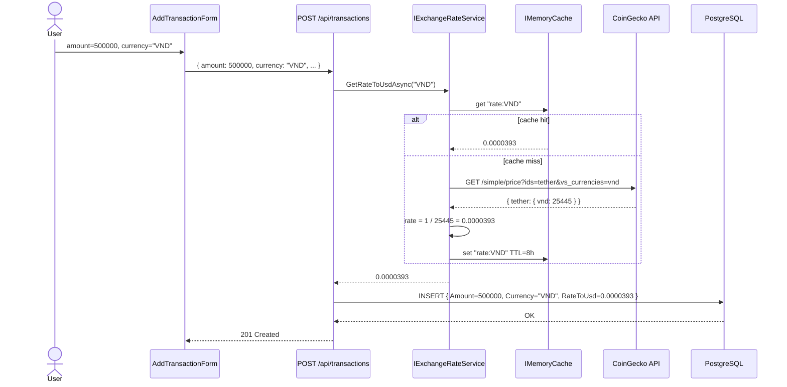
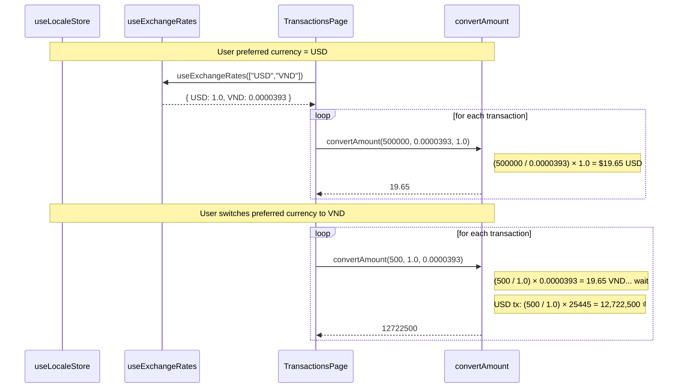
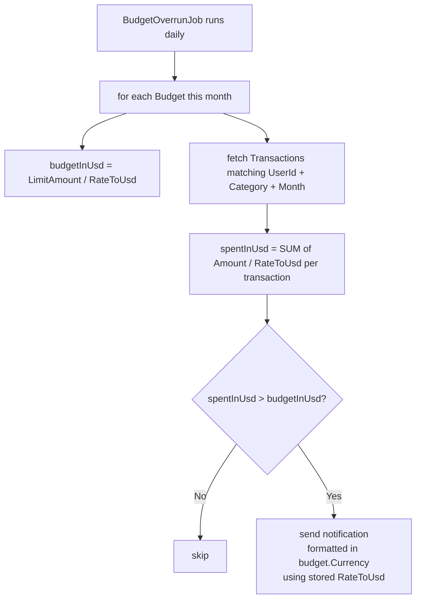
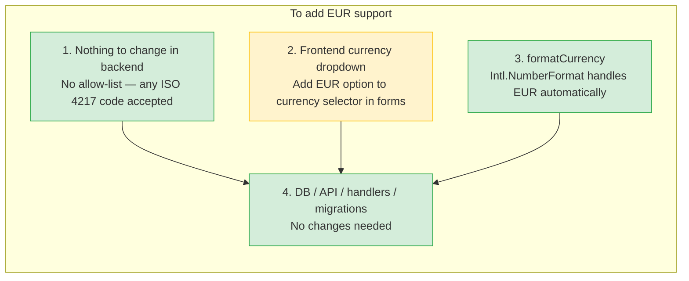

# Plan: Dual-Language (EN/VI) + Multi-Currency Support

> ⚠️ **PLAN — not yet implemented.** See implementation steps below before coding.

## Context

The original design stored currency only as a display preference on `AppUser` (`PreferredCurrency varchar(3)`),
with no currency column on any monetary entity. This created a silent data-integrity gap: two records with
`Amount = 500` could mean $500 or 500,000 VND depending on when the user toggled their display preference —
the DB had no way to tell them apart.

The new design stores `Currency` and `RateToUsd` on every monetary record at **creation time**.
`PreferredCurrency` on `AppUser` becomes a pure display preference (safe to toggle anytime).
On read, amounts are converted client-side using `displayAmount = (amount / rateToUsd) * livePreferredRate`.
Live rates are fetched from CoinGecko (already integrated) and cached in `IMemoryCache` (8 h TTL).
A `ExchangeRateSyncJob` (Hangfire) pre-warms the cache on startup and every 8 h so CoinGecko is
never on the critical path of a user request. The original fetch-on-demand fallback is always active —
if the job fails or the cache is cold, `GetRateToUsdAsync` falls back to CoinGecko directly.

**Scope: dual-language (EN/VI) + open currency (any ISO 4217 code — no hard allow-list).**

---

## Architecture Diagrams

### 1. System Overview — Layers and Components

```mermaid
graph TD
    subgraph Browser
        LS[(localStorage\nlocale-preferences)]
        subgraph React App
            LP[LocaleProvider]
            LS2[useLocaleStore\nZustand + persist]
            LSD[LocaleSettingsDropdown\nGear icon → popover]
            I18N[i18next\nen.ts / vi.ts]
            FC[formatCurrency\nIntl.NumberFormat]
            CA[convertAmount\namount / recordRate × prefRate]
            ER[useExchangeRates\nReact Query 1h cache]
            Pages[Pages + Features\nt() + formatCurrency(convertAmount())]
        end
    end

    subgraph ASP.NET Core API
        UC[UsersController\nGET /api/users/preferences\nPATCH /api/users/preferences]
        MC[MarketController\nGET /api/market/rates]
        subgraph MediatR Pipeline
            VB[ValidationBehavior]
            GQ[GetUserPreferencesQueryHandler]
            CMD[UpdateUserPreferencesCommandHandler]
            GR[GetExchangeRatesQueryHandler]
            TXH[CreateTransactionCommandHandler]
            TRH[CreateTradeCommandHandler]
            BGH[CreateBudgetCommandHandler]
        end
        ERS[IExchangeRateService\nCoinGeckoExchangeRateService\nIMemoryCache 8h TTL]
        ERSJ[ExchangeRateSyncJob\nHangfire every 8h\nstartup warm-up]
    end

    subgraph PostgreSQL
        AU[(AppUser\nPreferredLanguage varchar10\nPreferredCurrency varchar3)]
        TX[(Transactions\nCurrency varchar3\nRateToUsd numeric18_8)]
        TR[(Trades\nCurrency varchar3\nRateToUsd numeric18_8)]
        BG[(Budgets\nCurrency varchar3\nRateToUsd numeric18_8)]
    end

    LSD -- "setLanguage / setCurrency" --> LS2
    LS2 -- "i18n.changeLanguage()" --> I18N
    LS2 -- "currency" --> FC
    ER -- "ratesMap" --> CA
    CA -- "converted amount" --> FC
    LP -- "useUserPreferences()" --> UC
    LP -- "setLanguage + setCurrency" --> LS2
    LS2 <-- "persist / rehydrate" --> LS
    LSD -- "PATCH preferences" --> UC
    UC --> VB --> GQ & CMD --> AU
    MC --> VB --> GR --> ERS
    TXH & TRH & BGH --> ERS
    ERSJ -- "pre-warm / refresh" --> ERS
    TXH --> TX
    TRH --> TR
    BGH --> BG
```

---

### 2. Record Creation Flow — Rate Captured at Write Time



---

### 3. Display Conversion Flow — Convert at Read Time



---

### 4. BudgetOverrunJob — USD Normalisation



---

### 5. Scalability — Adding a New Currency



---

## DB Schema Changes

```
Transactions
  + Currency      varchar(3)    NOT NULL  default 'USD'
  + RateToUsd     numeric(18,8) NOT NULL  default 1.0

Budgets
  + Currency      varchar(3)    NOT NULL  default 'USD'
  + RateToUsd     numeric(18,8) NOT NULL  default 1.0

Trades
  + Currency      varchar(3)    NOT NULL  default 'USD'
  + RateToUsd     numeric(18,8) NOT NULL  default 1.0

AppUser
  + PreferredLanguage  varchar(10)  NOT NULL  default 'en'
  + PreferredCurrency  varchar(3)   NOT NULL  default 'USD'  ← display toggle only
```

---

## Implementation Order

### Phase 1 — Backend (DB → Domain → Application → API)

**1. New `IExchangeRateService` interface**
- File: `backend/src/FinTrackPro.Application/Common/Interfaces/IExchangeRateService.cs`
```csharp
public interface IExchangeRateService
{
    Task<decimal> GetRateToUsdAsync(string currencyCode, CancellationToken ct = default);
}
```

**2. `CoinGeckoExchangeRateService` implementation**
- File: `backend/src/FinTrackPro.Infrastructure/ExternalServices/CoinGeckoExchangeRateService.cs`
- Reuse the existing `HttpClient` registered for `CoinGeckoService` (same base URL `https://api.coingecko.com`)
- Call `/simple/price?ids=tether&vs_currencies={code}` → rate = `1 / response["tether"][code]`
- Inject `IMemoryCache`; cache key `$"rate:{code.ToUpperInvariant()}"`, TTL **8 h**
- USD shortcut: **return `1.0m` immediately** — no cache lookup, no network call
- Fallback guarantee: cache miss always falls through to CoinGecko — the job is a pre-warmer only, never a dependency
- Register in `AddInfrastructureServices()` as `services.AddScoped<IExchangeRateService, CoinGeckoExchangeRateService>()`

**3. Extend domain entities**
- `Transaction.cs` — add `public string Currency { get; private set; }` and `public decimal RateToUsd { get; private set; }`; update `Create()` to accept both; validate `currency` not empty
- `Budget.cs` — same; `UpdateLimit()` does NOT change `Currency` or `RateToUsd`
- `Trade.cs` — same; `Update()` accepts new `currency` + `rateToUsd` (rate may change if user corrects the currency on edit)
- `AppUser.cs` — add `PreferredLanguage` + `PreferredCurrency` with defaults `"en"` / `"USD"` + `UpdatePreferences()` method

**4. Update EF Core configurations**
- `TransactionConfiguration.cs` — `builder.Property(t => t.Currency).HasMaxLength(3).IsRequired().HasDefaultValue("USD")` + `builder.Property(t => t.RateToUsd).HasPrecision(18,8).IsRequired().HasDefaultValue(1.0)`
- `BudgetConfiguration.cs` — same
- `TradeConfiguration.cs` — same
- `AppUserConfiguration.cs` — add `PreferredLanguage` (MaxLength 10, default `"en"`) + `PreferredCurrency` (MaxLength 3, default `"USD"`)

**5. EF Core migration**
```bash
cd backend
dotnet ef migrations add AddCurrencyAndRateToRecords \
  --project src/FinTrackPro.Infrastructure \
  --startup-project src/FinTrackPro.API
dotnet ef database update \
  --project src/FinTrackPro.Infrastructure \
  --startup-project src/FinTrackPro.API
```

**6. Update Application commands — inject `IExchangeRateService`**

| Command | Change |
|---|---|
| `CreateTransactionCommand` | add `string Currency` |
| `CreateTransactionCommandHandler` | call `GetRateToUsdAsync(request.Currency)`, pass to `Transaction.Create()` |
| `CreateTransactionCommandValidator` | add `RuleFor(v => v.Currency).NotEmpty().MaximumLength(3)` |
| `CreateBudgetCommand` | add `string Currency` |
| `CreateBudgetCommandHandler` | same pattern |
| `CreateBudgetCommandValidator` | same validator rule |
| `UpdateBudgetCommand` | no currency field — budget currency is fixed at creation |
| `CreateTradeCommand` | add `string Currency` |
| `CreateTradeCommandHandler` | same pattern |
| `CreateTradeCommandValidator` | same validator rule |
| `UpdateTradeCommand` | add `string Currency`; handler re-fetches rate and updates entity |
| `UpdateTradeCommandValidator` | same validator rule |

**7. Update DTOs — expose `Currency` + `RateToUsd`**
- `TransactionDto` — add `string Currency`, `decimal RateToUsd`; update `operator` conversion
- `BudgetDto` — same
- `TradeDto` — same

**8. Add `GET /api/market/rates` endpoint**
- File: `backend/src/FinTrackPro.API/Controllers/MarketController.cs` (already exists — add action)
- New query: `Application/Market/Queries/GetExchangeRates/GetExchangeRatesQuery.cs` + handler
- Query: `record GetExchangeRatesQuery(string[] Currencies) : IRequest<Dictionary<string, decimal>>`
- Handler: calls `IExchangeRateService.GetRateToUsdAsync()` for each currency in parallel; returns map
- Route: `GET /api/market/rates?currencies=USD,VND`

**9. New `UsersController` + preferences CQRS**
- New dir: `Application/Users/Queries/GetUserPreferences/` — `GetUserPreferencesQuery`, `UserPreferencesDto`, `GetUserPreferencesQueryHandler`
- New dir: `Application/Users/Commands/UpdateUserPreferences/` — `UpdateUserPreferencesCommand`, `UpdateUserPreferencesCommandHandler`, `UpdateUserPreferencesCommandValidator`
- Validator: language allow-list `["en","vi"]`; **no allow-list for currency** — any non-empty 3-char string accepted
- New file: `backend/src/FinTrackPro.API/Controllers/UsersController.cs`
```csharp
[Authorize(Roles = UserRole.User)]
public class UsersController : BaseApiController
{
    [HttpGet("preferences")]
    public async Task<ActionResult<UserPreferencesDto>> GetPreferences()
        => Ok(await Mediator.Send(new GetUserPreferencesQuery()));

    [HttpPatch("preferences")]
    public async Task<IActionResult> UpdatePreferences(UpdateUserPreferencesCommand command)
    {
        await Mediator.Send(command);
        return NoContent();
    }
}
```

**10. Add `ExchangeRateSyncJob` — cache pre-warmer**
- File: `backend/src/FinTrackPro.BackgroundJobs/Jobs/ExchangeRateSyncJob.cs`
- Inject `IExchangeRateService` + `IConfiguration`
- Reads a configurable currency list from `appsettings.json` key `ExchangeRate:PreloadCurrencies` (e.g. `["VND","EUR","GBP"]`); USD is always skipped (hardcoded `1.0m`)
- Calls `GetRateToUsdAsync()` for each currency sequentially — populates `IMemoryCache` as a side effect
- Registered as a Hangfire recurring job every **8 h** in `Program.cs`
- Also called once in `IHostedService.StartAsync()` so the cache is warm before the first request
- **If the job throws, it logs and swallows the exception** — the API fallback path handles cold cache transparently
- `appsettings.json` addition:
  ```json
  "ExchangeRate": {
    "PreloadCurrencies": ["VND", "EUR", "GBP"]
  }
  ```

**11. Update `BudgetOverrunJob`**
- File: `backend/src/FinTrackPro.BackgroundJobs/Jobs/BudgetOverrunJob.cs`
- Use **stored `RateToUsd`** (not live rates) for consistency with historical records
- Logic:
  ```csharp
  var budgetInUsd = budget.LimitAmount / budget.RateToUsd;
  var spentInUsd  = transactions.Sum(t => t.Amount / t.RateToUsd);
  if (spentInUsd > budgetInUsd) // fire alert
  ```
- Alert message formats amounts back to `budget.Currency` using `budget.RateToUsd`

---

### Phase 2 — Frontend

**12. Install i18next**
```bash
cd frontend/fintrackpro-ui
npm install i18next react-i18next
```

**13. Create translation files**
- New dir: `src/shared/i18n/`
- `en.ts` + `vi.ts` — typed `as const` objects; keys: `nav`, `dashboard`, `transactions`, `budgets`, `trades`, `settings`, `notifications`, `common`
- `index.ts` — `i18n.use(initReactI18next).init(...)` with both resources; exports `type Language = 'en' | 'vi'`

**14. `formatCurrency` utility**
- File: `src/shared/lib/formatCurrency.ts`
- Signature: `formatCurrency(amount: number, currency: string): string`
- Uses `Intl.NumberFormat(undefined, { style: 'currency', currency, maximumFractionDigits: currency === 'VND' ? 0 : 2 })`
- Handles any ISO 4217 code; VND naturally gets 0 decimals

**15. `convertAmount` utility**
- File: `src/shared/lib/convertAmount.ts`
- `convertAmount(amount: number, recordRateToUsd: number, preferredRateToUsd: number): number`
- Formula: `(amount / recordRateToUsd) * preferredRateToUsd`

**16. `useExchangeRates` React Query hook**
- File: `src/entities/exchange-rate/api/exchangeRateApi.ts`
- `useExchangeRates(currencies: string[])` — `useQuery` → `GET /api/market/rates?currencies=...`
- `staleTime: 8 * 60 * 60 * 1000` (8 h — mirrors backend TTL)
- Returns `Record<string, number>` map

**17. `useLocaleStore` (Zustand + persist)**
- File: `src/features/locale/model/localeStore.ts`
- State: `language: Language`, `currency: string`; `setLanguage` calls `i18n.changeLanguage()`
- `persist` middleware with localStorage key `'locale-preferences'` — prevents reload flash
- Export barrel: `src/features/locale/index.ts`

**18. `user-preferences` entity (React Query hooks)**
- New dir: `src/entities/user-preferences/`
- `useUserPreferences()` — `useQuery` → `GET /api/users/preferences`
- `useUpdateUserPreferences()` — `useMutation` → `PATCH /api/users/preferences`; invalidates `['user-preferences']`

**19. `LocaleProvider`**
- File: `src/app/providers/LocaleProvider.tsx`
- Calls `useUserPreferences()` on mount; when data arrives calls `setLanguage` + `setCurrency` on store
- Server is source of truth; survives multi-device use
- Add to `src/app/providers/index.ts`

**20. Wire i18n + `LocaleProvider` into `App.tsx`**
- Add `import '@/shared/i18n'` at top (side-effect init)
- Wrap tree with `<LocaleProvider>` inside `<QueryProvider>`

**21. `LocaleSettingsDropdown` widget**
- File: `src/widgets/navbar/ui/LocaleSettingsDropdown.tsx`
- Gear icon → popover: Language row `[EN] [VI]` + Currency row `[USD] [VND]`
- On toggle: updates `localeStore` immediately (optimistic), fires `PATCH`; `toast.error` on failure

**22. Update `Navbar.tsx`**
- Replace static `links` array with `useNavLinks()` hook calling `useTranslation()`
- Add `<LocaleSettingsDropdown />` between hamburger and avatar

**23. Apply `useTranslation` + `convertAmount` + `formatCurrency` to all pages and forms**

Usage pattern in every monetary display:
```tsx
const { t } = useTranslation()
const { currency: preferredCurrency } = useLocaleStore()
const rates = useExchangeRates([preferredCurrency])
const preferredRate = rates[preferredCurrency] ?? 1

// in render:
formatCurrency(convertAmount(record.amount, record.rateToUsd, preferredRate), preferredCurrency)
```

Add `currency` field (dropdown defaulting to user's `PreferredCurrency`) to all create/edit forms.

| File | Changes |
|---|---|
| `DashboardPage.tsx` | Stat labels + all amounts |
| `TransactionsPage.tsx` | Column headers, amounts, empty state |
| `BudgetsPage.tsx` | Amounts, over-budget message |
| `TradesPage.tsx` | All price/fee/P&L columns |
| `SettingsPage.tsx` | Section headers |
| `AddTransactionForm.tsx` | Form labels, add currency dropdown, button |
| `AddBudgetForm.tsx` | Form labels, add currency dropdown, button |
| `NotificationSettingsForm.tsx` | Labels, button |
| `NotFoundPage.tsx` | Error message |

---

### Phase 3 — Documentation

**24. Update `docs/architecture/api-spec.md`**
- Add `GET /api/users/preferences` and `PATCH /api/users/preferences` endpoint entries (request/response schemas)
- Add `GET /api/market/rates` endpoint entry with query param `currencies` and response schema `{ [code]: number }`
- Update `POST /api/transactions`, `POST /api/budgets`, `POST /api/trades`, `PUT /api/trades/:id` request schemas to include `currency: string`
- Update response schemas for all three to include `currency` and `rateToUsd` fields

**25. Update `docs/architecture/database.md`**
- Add `Currency varchar(3)` and `RateToUsd numeric(18,8)` to `Transactions`, `Budgets`, and `Trades` table definitions
- Add `PreferredLanguage varchar(10)` and `PreferredCurrency varchar(3)` to the `AppUsers` table definition
- Add migration name `AddCurrencyAndRateToRecords` to the migration history section

**26. Update `docs/architecture/background-jobs.md`**
- Add `ExchangeRateSyncJob` entry: schedule (every 8 h + startup), purpose (cache pre-warmer), config key (`ExchangeRate:PreloadCurrencies`), failure behaviour (silent — API fallback always active)
- Update `BudgetOverrunJob` entry: overrun comparison now normalises all amounts to USD via stored `RateToUsd` before comparing

**27. Update `docs/architecture/overview.md`**
- Add `IExchangeRateService` / `CoinGeckoExchangeRateService` to the Infrastructure layer description
- Note the `Currency` + `RateToUsd` per-record design decision and why `PreferredCurrency` is display-only

**28. Update `docs/guides/dev-setup.md`**
- Add `ExchangeRate:PreloadCurrencies` to the local configuration table
- Note that on first startup `ExchangeRateSyncJob` calls CoinGecko — requires internet access (or mock the rate in integration tests)

**29. Update `README.md` and `backend/README.md`**
- Add `GET /api/market/rates` and `GET|PATCH /api/users/preferences` to the API overview section
- Add `ExchangeRate:PreloadCurrencies` to the environment variable / config table
- Note the multi-currency design: amounts stored with `Currency` + `RateToUsd`; `PreferredCurrency` is display-only

**30. Update `frontend/fintrackpro-ui/README.md`**
- Add `useExchangeRates`, `useLocaleStore`, `convertAmount`, `formatCurrency` to the shared utilities section
- Note the `locale-preferences` localStorage key and what it persists
- Add i18next setup note: translation files are bundled at build time (`en.ts`, `vi.ts`) — no runtime network calls

---

## Complete File Inventory

### Backend — New Files
```
Application/Common/Interfaces/IExchangeRateService.cs
Infrastructure/ExternalServices/CoinGeckoExchangeRateService.cs
Application/Users/Queries/GetUserPreferences/GetUserPreferencesQuery.cs
Application/Users/Queries/GetUserPreferences/GetUserPreferencesQueryHandler.cs
Application/Users/Queries/GetUserPreferences/UserPreferencesDto.cs
Application/Users/Commands/UpdateUserPreferences/UpdateUserPreferencesCommand.cs
Application/Users/Commands/UpdateUserPreferences/UpdateUserPreferencesCommandHandler.cs
Application/Users/Commands/UpdateUserPreferences/UpdateUserPreferencesCommandValidator.cs
Application/Market/Queries/GetExchangeRates/GetExchangeRatesQuery.cs
Application/Market/Queries/GetExchangeRates/GetExchangeRatesQueryHandler.cs
API/Controllers/UsersController.cs
BackgroundJobs/Jobs/ExchangeRateSyncJob.cs
Infrastructure/Migrations/[timestamp]_AddCurrencyAndRateToRecords.cs        (generated)
Infrastructure/Migrations/[timestamp]_AddCurrencyAndRateToRecords.Designer.cs  (generated)
```

### Backend — Modified Files
```
Domain/Entities/Transaction.cs
Domain/Entities/Budget.cs
Domain/Entities/Trade.cs
Domain/Entities/AppUser.cs
Infrastructure/Persistence/Configurations/TransactionConfiguration.cs
Infrastructure/Persistence/Configurations/BudgetConfiguration.cs
Infrastructure/Persistence/Configurations/TradeConfiguration.cs
Infrastructure/Persistence/Configurations/AppUserConfiguration.cs
Infrastructure/Migrations/ApplicationDbContextModelSnapshot.cs             (auto-updated)
Infrastructure/DependencyInjection.cs
Application/Finance/Commands/CreateTransaction/CreateTransactionCommand.cs
Application/Finance/Commands/CreateTransaction/CreateTransactionCommandHandler.cs
Application/Finance/Commands/CreateTransaction/CreateTransactionCommandValidator.cs
Application/Finance/Commands/CreateBudget/CreateBudgetCommand.cs
Application/Finance/Commands/CreateBudget/CreateBudgetCommandHandler.cs
Application/Finance/Commands/CreateBudget/CreateBudgetCommandValidator.cs
Application/Finance/Queries/GetBudgets/BudgetDto.cs
Application/Finance/Queries/GetTransactions/TransactionDto.cs
Application/Trading/Commands/CreateTrade/CreateTradeCommand.cs
Application/Trading/Commands/CreateTrade/CreateTradeCommandHandler.cs
Application/Trading/Commands/CreateTrade/CreateTradeCommandValidator.cs
Application/Trading/Commands/UpdateTrade/UpdateTradeCommand.cs
Application/Trading/Commands/UpdateTrade/UpdateTradeCommandHandler.cs
Application/Trading/Commands/UpdateTrade/UpdateTradeCommandValidator.cs
Application/Trading/Queries/GetTrades/TradeDto.cs
API/Controllers/MarketController.cs
BackgroundJobs/Jobs/BudgetOverrunJob.cs
```

### Frontend — New Files
```
src/shared/i18n/en.ts
src/shared/i18n/vi.ts
src/shared/i18n/index.ts
src/shared/lib/formatCurrency.ts
src/shared/lib/convertAmount.ts
src/entities/exchange-rate/api/exchangeRateApi.ts
src/entities/exchange-rate/index.ts
src/entities/user-preferences/model/types.ts
src/entities/user-preferences/api/userPreferencesApi.ts
src/entities/user-preferences/index.ts
src/features/locale/model/localeStore.ts
src/features/locale/index.ts
src/app/providers/LocaleProvider.tsx
src/widgets/navbar/ui/LocaleSettingsDropdown.tsx
```

### Frontend — Modified Files
```
src/app/App.tsx
src/app/providers/index.ts
src/widgets/navbar/ui/Navbar.tsx
src/pages/dashboard/ui/DashboardPage.tsx
src/pages/transactions/ui/TransactionsPage.tsx
src/pages/budgets/ui/BudgetsPage.tsx
src/pages/trades/ui/TradesPage.tsx
src/pages/settings/ui/SettingsPage.tsx
src/features/add-transaction/ui/AddTransactionForm.tsx
src/features/add-budget/ui/AddBudgetForm.tsx
src/features/notification-settings/ui/NotificationSettingsForm.tsx
src/shared/ui/NotFoundPage.tsx
src/entities/trade/model/types.ts
src/entities/budget/model/types.ts
src/entities/transaction/model/types.ts
```

### Backend Tests — New Files
```
Tests.Common/FakeCoinGeckoExchangeRateService.cs
FinTrackPro.Domain.UnitTests/Users/AppUserPreferencesTests.cs
FinTrackPro.Application.UnitTests/Validators/UpdateUserPreferencesCommandValidatorTests.cs
FinTrackPro.Application.UnitTests/Application/Users/GetUserPreferencesHandlerTests.cs
FinTrackPro.Application.UnitTests/Application/Users/UpdateUserPreferencesHandlerTests.cs
FinTrackPro.Infrastructure.UnitTests/ExternalServices/CoinGeckoExchangeRateServiceTests.cs
FinTrackPro.Api.IntegrationTests/Features/Users/UserPreferencesTests.cs
FinTrackPro.Api.IntegrationTests/Features/Market/ExchangeRatesTests.cs
```

### Backend Tests — Modified Files
```
Tests.Common/Builders/TransactionRequestBuilder.cs
Tests.Common/Builders/BudgetRequestBuilder.cs
Tests.Common/Builders/TradeRequestBuilder.cs
FinTrackPro.Domain.UnitTests/Finance/TransactionTests.cs
FinTrackPro.Domain.UnitTests/Finance/BudgetTests.cs
FinTrackPro.Domain.UnitTests/Trading/TradeTests.cs
FinTrackPro.Application.UnitTests/Validators/CreateTransactionCommandValidatorTests.cs
FinTrackPro.Application.UnitTests/Validators/CreateTradeCommandValidatorTests.cs
FinTrackPro.Application.UnitTests/Finance/CreateTransactionHandlerTests.cs
FinTrackPro.Application.UnitTests/Trading/CreateTradeHandlerTests.cs
FinTrackPro.Api.IntegrationTests/Features/Finance/TransactionsTests.cs
FinTrackPro.Api.IntegrationTests/Features/Finance/BudgetsTests.cs
FinTrackPro.Api.IntegrationTests/Features/Trading/TradesTests.cs
```

### Frontend Tests — New Files
```
src/shared/lib/convertAmount.test.ts
src/shared/lib/formatCurrency.test.ts
src/entities/exchange-rate/api/exchangeRateApi.test.ts
src/entities/user-preferences/api/userPreferencesApi.test.ts
src/features/locale/model/localeStore.test.ts
tests/e2e/locale.spec.ts
```

### Frontend Tests — Modified Files
```
src/entities/transaction/api/transactionApi.test.ts
src/entities/trade/api/tradeApi.test.ts
src/entities/budget/api/budgetApi.test.ts
tests/e2e/transactions.spec.ts
tests/e2e/trades.spec.ts
tests/e2e/budgets.spec.ts
```

### Newman / Postman API E2E — Modified Files
```
docs/postman/FinTrackPro.postman_collection.json
docs/postman/FinTrackPro.postman_environment.json
docs/postman/api-e2e-plan.md
```

### Documentation — Modified Files
```
docs/architecture/api-spec.md
docs/architecture/database.md
docs/architecture/background-jobs.md
docs/architecture/overview.md
docs/guides/dev-setup.md
README.md
backend/README.md
frontend/fintrackpro-ui/README.md
```

---

## Key Design Decisions

| Decision | Rationale |
|---|---|
| `Currency` + `RateToUsd` on every monetary record | Lossless — original value and unit preserved forever; eliminates the ambiguous-amount gap |
| `RateToUsd` stored at creation, not fetched on read | P&L and budget history are stable; a 6-month-old trade shows the same converted value every day |
| CoinGecko for rate fetch | Already integrated; reuses existing HTTP client — no new registration needed |
| `IMemoryCache` TTL = **8 h** | Fiat rates (VND/USD) move < 0.5%/day; 8 h staleness is negligible for personal finance |
| USD hardcoded to `1.0m` | Skips cache + network entirely — zero overhead for the common case |
| `ExchangeRateSyncJob` pre-warms cache | CoinGecko never on the critical path of a user write; job failure is silent — API fallback always active |
| **No allow-list on `Currency` validator** | Enables any ISO 4217 code without schema or code changes; scales to EUR, JPY, GBP freely |
| Budget overrun uses stored `RateToUsd` | No live rate call in background job; consistent with how records were created |
| `Intl.NumberFormat` in `formatCurrency` | Handles any currency automatically; VND gets 0 decimals naturally; no per-currency hard-coding |
| `convertAmount` utility isolated | Single formula `(amount / recordRate) × preferredRate`; trivially unit-testable |
| `PreferredCurrency` on `AppUser` is display-only | Safe to toggle anytime; historical data integrity is preserved in the record's own `Currency` + `RateToUsd` |
| Zustand `persist` (localStorage) | Prevents EN/USD flash on reload before API responds |
| `LocaleProvider` syncs from backend on login | Server is source of truth; survives multi-device use |

---

## Test Updates Required

These are the automated test files that must be created or updated as part of this implementation.
All existing tests must continue to pass — changes below are additions or signature fixes only.

---

### Backend — `Tests.Common` (shared builders)

**`Tests.Common/Builders/TransactionRequestBuilder.cs`**
- Add `string? currency = null` parameter to `Build()`
- Default to `"USD"` when `null`
- Include `currency` in the returned anonymous object

**`Tests.Common/Builders/BudgetRequestBuilder.cs`**
- Add `string? currency = null` parameter to `Build()`
- Default to `"USD"` when `null`
- Include `currency` in the returned anonymous object

**`Tests.Common/Builders/TradeRequestBuilder.cs`**
- Add `string? currency = null` parameter to `Build()`
- Default to `"USD"` when `null`
- Include `currency` in the returned anonymous object

**`Tests.Common/FakeBinanceService.cs`** (pattern reference)
- New file: `Tests.Common/FakeCoinGeckoExchangeRateService.cs`
- Implements `IExchangeRateService`
- Returns configurable rates (default: `"USD"→1.0m`, `"VND"→0.0000393m`)
- Used by Application unit tests and integration tests to avoid real CoinGecko calls

---

### Backend — Domain Unit Tests (`FinTrackPro.Domain.UnitTests`)

**`Finance/TransactionTests.cs`** — add:
- `Create_ValidArguments_StoresCurrencyAndRate` — asserts `Currency` and `RateToUsd` are stored
- `Create_WithVndCurrency_StoresCorrectly` — creates with `Currency="VND"`, `RateToUsd=0.0000393m`, asserts both fields

**`Finance/BudgetTests.cs`** — add:
- `Create_ValidArguments_StoresCurrencyAndRate`
- `UpdateLimit_DoesNotChangeCurrencyOrRate` — asserts `Currency` and `RateToUsd` unchanged after `UpdateLimit()`

**`Trading/TradeTests.cs`** — add:
- `Create_ValidArguments_StoresCurrencyAndRate`
- `Update_ChangesCurrencyAndRate` — asserts `Currency` and `RateToUsd` are updated on `Update()`

**New: `Users/AppUserPreferencesTests.cs`**
- `UpdatePreferences_SetsLanguageAndCurrency`
- `UpdatePreferences_DefaultValues_AreEnAndUsd`

---

### Backend — Application Unit Tests (`FinTrackPro.Application.UnitTests`)

**`Validators/CreateTransactionCommandValidatorTests.cs`** — add:
- `Validate_EmptyCurrency_Fails`
- `Validate_CurrencyExceedsThreeChars_Fails` — e.g. `"USDD"` → invalid
- `Validate_ValidCurrency_Passes` — `"USD"`, `"VND"`, `"EUR"` all pass

**`Validators/CreateTradeCommandValidatorTests.cs`** — add same three currency cases

**New: `Validators/UpdateUserPreferencesCommandValidatorTests.cs`**
- `Validate_ValidLanguageAndCurrency_Passes` — `{ language:"vi", currency:"VND" }`
- `Validate_InvalidLanguage_Fails` — `language:"fr"` → fails (allow-list `["en","vi"]`)
- `Validate_EmptyCurrency_Fails`
- `Validate_AnyCurrencyCode_Passes` — `"EUR"`, `"JPY"` all pass (no currency allow-list)

**`Finance/CreateTransactionHandlerTests.cs`** — update:
- Inject `FakeCoinGeckoExchangeRateService` into handler constructor
- Update `Handle_ValidCommand_ReturnsNewGuid` — command now includes `Currency = "USD"`
- Add `Handle_VndCurrency_StoresRateFromService` — asserts handler calls `GetRateToUsdAsync("VND")` and passes result to `Transaction.Create()`

**`Trading/CreateTradeHandlerTests.cs`** — same pattern as above for `CreateTradeCommandHandler`

**New: `Application/Users/GetUserPreferencesHandlerTests.cs`**
- `Handle_ValidUser_ReturnsLanguageAndCurrency`
- `Handle_UserNotFound_ThrowsNotFoundException`

**New: `Application/Users/UpdateUserPreferencesHandlerTests.cs`**
- `Handle_ValidCommand_UpdatesUserAndSaves`
- `Handle_UserNotFound_ThrowsNotFoundException`

**New: `Infrastructure/ExternalServices/CoinGeckoExchangeRateServiceTests.cs`** (mirrors `BinanceServiceTests.cs`)
- `GetRateToUsdAsync_Usd_ReturnsOneWithoutNetworkCall` — USD shortcut: no HTTP call made
- `GetRateToUsdAsync_ValidPayload_ParsesRateCorrectly` — mock HTTP returns `{"tether":{"vnd":25445}}` → asserts `1/25445`
- `GetRateToUsdAsync_CachesResult_DoesNotCallNetworkTwice` — two calls, one HTTP request
- `GetRateToUsdAsync_NullResponse_ThrowsOrReturnsDefault` — graceful handling
- `GetRateToUsdAsync_CacheHit_ReturnsCachedValue` — populates `IMemoryCache`, second call uses it

---

### Backend — Integration Tests (`FinTrackPro.Api.IntegrationTests`)

**`Features/Finance/TransactionsTests.cs`** — update:
- All `TransactionRequestBuilder.Build()` calls already default to `currency: "USD"` after builder update — no test logic changes
- Add `CreateTransaction_WithVndCurrency_Returns201AndStoresCurrency` — posts `currency:"VND"`, reads back response, asserts `currency` field present
- Add `CreateTransaction_MissingCurrency_Returns400`

**`Features/Finance/BudgetsTests.cs`** — same pattern:
- Add `CreateBudget_WithVndCurrency_Returns201`
- Add `CreateBudget_MissingCurrency_Returns400`

**`Features/Trading/TradesTests.cs`** — same pattern:
- Add `CreateTrade_WithUsdCurrency_Returns201AndStoresCurrency`
- Add `CreateTrade_MissingCurrency_Returns400`

**New: `Features/Users/UserPreferencesTests.cs`**
- `GetPreferences_Authenticated_Returns200WithDefaults` — fresh user → `{ language:"en", currency:"USD" }`
- `UpdatePreferences_ValidPayload_Returns204`
- `UpdatePreferences_InvalidLanguage_Returns400` — `language:"fr"` → 400
- `UpdatePreferences_AnyCurrency_Returns204` — `currency:"EUR"` → 204 (no allow-list)
- `GetPreferences_AfterUpdate_ReturnsNewValues` — PATCH then GET → confirms persisted

**New: `Features/Market/ExchangeRatesTests.cs`**
- `GetExchangeRates_UsdOnly_Returns1WithoutCoinGeckoCall`
- `GetExchangeRates_MultiCurrency_ReturnsMapWithAllRequested`
- `GetExchangeRates_UnknownCurrency_Returns400OrHandledGracefully`

---

### Frontend — Vitest Unit Tests

**`src/entities/transaction/api/transactionApi.test.ts`** — update:
- `mockTransactions` — add `currency: "USD"` and `rateToUsd: 1.0` fields to match new DTO shape
- `useCreateTransaction` test — include `currency: "USD"` in the mutate payload

**`src/entities/trade/api/tradeApi.test.ts`** — update:
- `mockTrades` — add `currency: "USD"` and `rateToUsd: 1.0`
- `useCreateTrade` test — include `currency: "USD"` in the mutate payload

**`src/entities/budget/api/budgetApi.test.ts`** — update same way

**New: `src/shared/lib/convertAmount.test.ts`**
- `convertAmount(500000, 0.0000393, 1.0)` → `≈19.65` (VND record displayed in USD)
- `convertAmount(500, 1.0, 25445)` → `12722500` (USD record displayed in VND)
- `convertAmount(100, 1.0, 1.0)` → `100` (same currency, no conversion)
- `convertAmount(amount, rate, rate)` → `amount` (same rate both sides = identity)

**New: `src/shared/lib/formatCurrency.test.ts`**
- `formatCurrency(19.65, "USD")` → `"$19.65"`
- `formatCurrency(500000, "VND")` → `"500,000 ₫"` (0 decimals)
- `formatCurrency(19.65, "EUR")` → `"€19.65"` (any ISO 4217 code works)

**New: `src/entities/exchange-rate/api/exchangeRateApi.test.ts`** (mirrors `transactionApi.test.ts` pattern)
- `useExchangeRates` fetches `GET /api/market/rates?currencies=USD,VND`
- Returns `{ USD: 1.0, VND: 0.0000393 }`
- `staleTime` is 8 h (assert query options)

**New: `src/entities/user-preferences/api/userPreferencesApi.test.ts`**
- `useUserPreferences` fetches `GET /api/users/preferences`
- `useUpdateUserPreferences` patches `PATCH /api/users/preferences` and invalidates `['user-preferences']`

**New: `src/features/locale/model/localeStore.test.ts`** (mirrors `authStore.test.ts` pattern)
- Initial state is `{ language: "en", currency: "USD" }`
- `setLanguage("vi")` updates language and calls `i18n.changeLanguage("vi")`
- `setCurrency("VND")` updates currency
- Store is persisted to `localStorage` under key `'locale-preferences'`

---

### Frontend — Playwright E2E Tests

**`tests/e2e/transactions.spec.ts`** — update:
- `create transaction` test: after adding the currency dropdown to the form, select `USD` explicitly (or verify the default) before submitting
- Assert the row displays `$85.50` format (or whatever `formatCurrency` produces) rather than hardcoded `-$85.50` string

**`tests/e2e/trades.spec.ts`** — update similarly for currency dropdown

**`tests/e2e/budgets.spec.ts`** — update similarly for currency dropdown

**New: `tests/e2e/locale.spec.ts`**
- `gear icon is visible in navbar`
- `switching language to VI updates nav labels`
- `switching currency to VND reformats amounts`
- `locale preference persists after hard reload` — reloads page, asserts still VND

---

### Newman / Postman API E2E

The existing collection covers the full lifecycle of Trades, Budgets, Transactions, WatchedSymbols, Authorization Guards, Validation, and Market endpoints against a real running API with a real Keycloak JWT. The following changes bring it in line with the new currency fields.

**`docs/postman/FinTrackPro.postman_collection.json`** — update existing requests:

- `POST /api/trades → 201` body: add `"currency": "USD"` to the raw JSON
- `PUT /api/trades/{{tradeId}} → 200` body: add `"currency": "USD"` to the raw JSON
- `GET /api/trades` test script: add assertions `pm.expect(trade).to.have.property('currency')` and `pm.expect(trade).to.have.property('rateToUsd')`
- `POST /api/budgets → 201` body: add `"currency": "USD"` to the raw JSON
- `POST /api/transactions → 201` body: add `"currency": "USD"` to the raw JSON
- `GET /api/transactions` test script: add assertions for `currency` and `rateToUsd` fields on the returned transaction
- Guard seed requests (`Seed trade for guard tests`, `Seed budget for guard tests`): add `"currency": "USD"` to both bodies
- Validation folder `POST /api/trades (entryPrice=-1)` body: add `"currency": "USD"` so only `entryPrice` is invalid (avoids masking the target 400 with a missing-currency 400)
- Validation folder `PUT /api/trades (symbol=invalid lowercase)` body: add `"currency": "USD"` for the same reason
- Validation folder `POST /api/transactions (amount=-50)` body: add `"currency": "USD"`

**`docs/postman/FinTrackPro.postman_collection.json`** — add new requests:

New folder **`User Preferences`** (insert between `Auth` and `Trades — Full lifecycle`):
```
User Preferences/
  GET  /api/users/preferences → 200, has language + currency fields (defaults "en"/"USD")
  PATCH /api/users/preferences { language:"vi", currency:"VND" } → 204
  GET  /api/users/preferences → 200, language="vi", currency="VND"
  PATCH /api/users/preferences { language:"en", currency:"USD" } → 204  ← restore for subsequent folders
```

New requests in **`Market`** folder:
```
GET /api/market/rates?currencies=USD,VND → 200
  assert: body.USD === 1.0
  assert: body.VND is a number > 0 and < 1
  assert: no CoinGecko latency spike (response time < 500ms — served from cache)
```

New cases in **`Validation`** folder:
```
POST /api/transactions (missing currency field) → 400
POST /api/trades      (missing currency field) → 400
POST /api/budgets     (missing currency field) → 400
```

**`docs/postman/FinTrackPro.postman_environment.json`** — no new variables needed; `currency` is a request body field, not an environment variable.

**`docs/postman/api-e2e-plan.md`** — update collection structure diagram to include the new `User Preferences` folder and the `GET /api/market/rates` request; update the `Validation` folder entries to note the three missing-currency cases.

---

## Verification / End-to-End Test Plan

### Backend
1. `dotnet build` — no errors
2. `dotnet test` — all existing tests pass
3. `POST /api/transactions` `{ amount: 500, currency: "USD", ... }` → `201`; DB row: `Currency="USD"`, `RateToUsd=1.0`
4. `POST /api/transactions` `{ amount: 500000, currency: "VND", ... }` → `201`; DB row: `Currency="VND"`, `RateToUsd≈0.0000393`
5. `GET /api/transactions` → both rows include `currency` + `rateToUsd` fields
6. `GET /api/market/rates?currencies=USD,VND` → `{ "USD": 1.0, "VND": 0.0000393 }` (USD always `1.0`, no CoinGecko call)
7. `PATCH /api/users/preferences` `{ language: "vi", currency: "VND" }` → `204`
8. `PATCH /api/users/preferences` `{ language: "fr", currency: "EUR" }` → `204` (no allow-list rejection)
9. BudgetOverrunJob: create budget in USD, add mixed USD + VND transactions → job converts via stored rates and correctly detects overrun
10. API cold start: stop the app, clear `IMemoryCache`, restart → first `POST /api/transactions` with `currency: "VND"` still succeeds (fallback fetch from CoinGecko)
11. `ExchangeRateSyncJob` runs at startup → `/hangfire` dashboard shows job completed; subsequent transaction creates are cache hits

### Frontend
1. `npm run build` — no TypeScript errors
2. Log in → Navbar shows English; gear icon between hamburger and avatar
3. Click gear → popover shows `[EN] [VI]` + `[USD] [VND]`
4. Add transaction with `currency: "VND"` → `500000 VND` stored; display shows `500,000 ₫`
5. Switch display to USD → same transaction shows `$19.65` via `convertAmount`
6. Switch display back to VND → `500,000 ₫` restored
7. Hard reload → locale restored from `localStorage` instantly; API sync confirms it
8. Log out → log back in → preferences persist from `AppUser` in DB

### Documentation
1. `docs/architecture/api-spec.md` — `GET /api/market/rates`, `GET|PATCH /api/users/preferences`, and updated `POST /api/transactions|budgets|trades` schemas all documented
2. `docs/architecture/database.md` — `Currency`, `RateToUsd`, `PreferredLanguage`, `PreferredCurrency` columns present in table definitions; migration listed
3. `docs/architecture/background-jobs.md` — `ExchangeRateSyncJob` entry present; `BudgetOverrunJob` updated to reflect USD normalisation
4. `docs/architecture/overview.md` — `IExchangeRateService` in Infrastructure layer; per-record currency design noted
5. `docs/guides/dev-setup.md` — `ExchangeRate:PreloadCurrencies` in config table
6. `README.md` + `backend/README.md` — new endpoints and config key present
7. `frontend/fintrackpro-ui/README.md` — `useExchangeRates`, `useLocaleStore`, `convertAmount`, `formatCurrency`, and `locale-preferences` localStorage key documented
