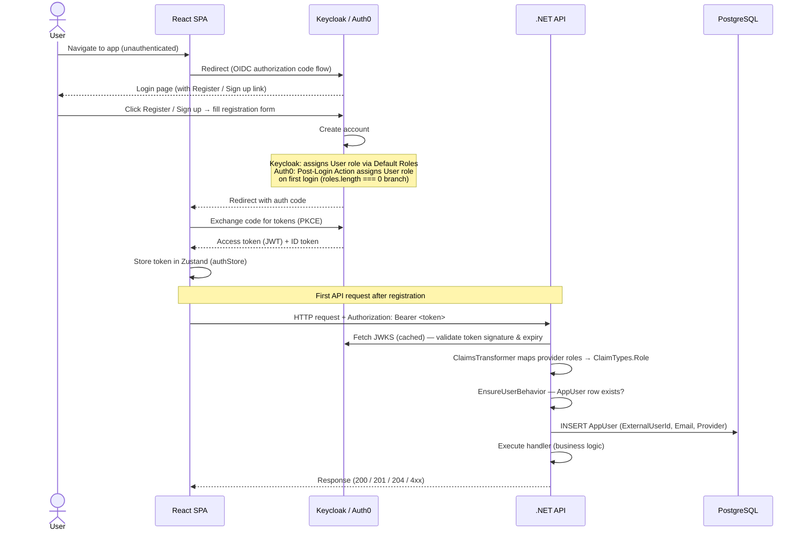
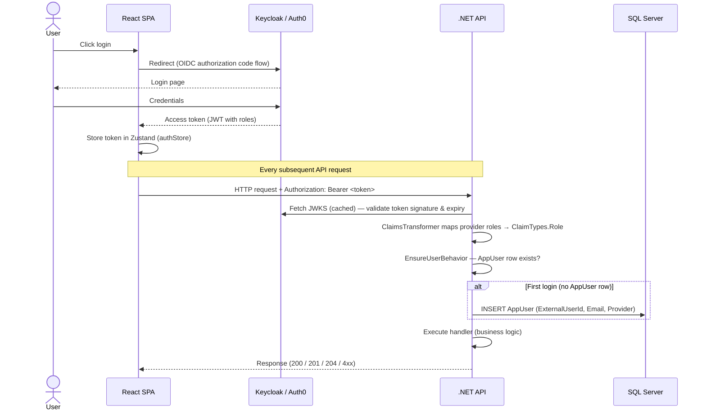
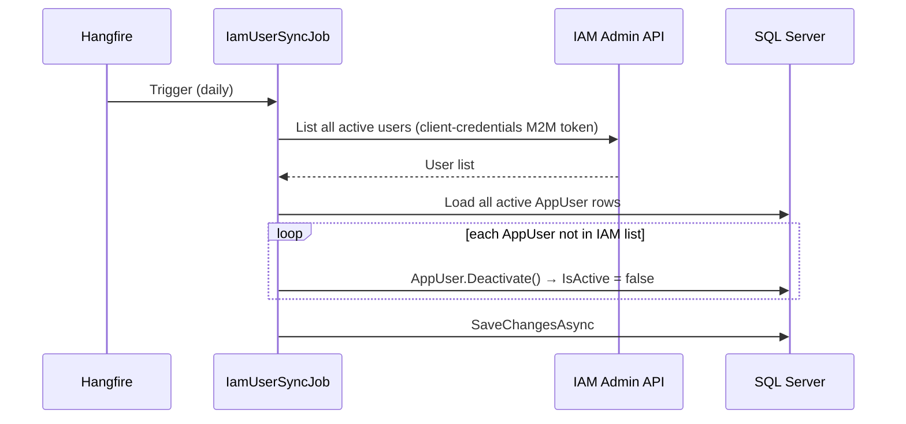

# IAM Provider Setup

FinTrackPro supports two interchangeable IAM providers. The provider is selected by a single config key — no code changes required.

## Contents

- [Overview](#overview)
- [Keycloak (local / Docker)](#keycloak-local--docker)
  - [Automatic provisioning](#automatic-provisioning)
  - [Manual setup reference](#manual-setup-reference)
- [Auth0 (cloud IAM)](#auth0-cloud-iam)
  - [One-time Auth0 Dashboard configuration](#one-time-auth0-dashboard-configuration)
  - [Backend configuration for Auth0](#backend-configuration-for-auth0)
  - [Frontend configuration for Auth0](#frontend-configuration-for-auth0)
  - [Auth0 with Full Docker](#auth0-with-full-docker)
- [Switching Providers](#switching-providers)

---

## Overview

| | Keycloak | Auth0 |
|---|---|---|
| **Hosting** | Self-hosted (Docker) | Cloud (SaaS) |
| **Best for** | Local dev, on-prem | Cloud deployments, no-infra dev |
| **Free tier** | Unlimited | 7,500 MAU |
| **Setup effort** | Zero (auto-provisioned) | One-time dashboard config |
| **Config key** | `"keycloak"` | `"auth0"` |

Both providers issue JWT Bearer tokens. All RBAC rules, controllers, and handlers are identical — only infrastructure and config differ.

---

## Auth Flow

### Sign-up / Registration




### Login & API Request




### Nightly IAM User Sync



---

## Keycloak (local / Docker)

### Automatic provisioning

The `fintrackpro` realm is **automatically imported** from `infra/docker/keycloak-realm.json` when the Keycloak container starts. No manual configuration is needed.

```bash
docker compose up -d keycloak
```

- Default admin credentials: `admin@fintrackpro.dev` / `Admin1234!`
- The import is idempotent — if the realm already exists (volume persisted from a previous run), the JSON is silently skipped, preserving any manual changes.

> **Assign Admin role manually:** Go to **Users** → select a user → **Role mappings** → assign the `Admin` realm role. Admin users can access the Hangfire dashboard at `/hangfire`.

---

### Manual setup reference

Only needed if you wiped the Docker volume, added a new social login provider, or need to recreate the realm from scratch.

#### Sign in and create the realm

1. Open http://localhost:8080 and sign in with **`admin`** / **`admin`**.
2. Hover over the realm name in the top-left (defaults to **`master`**) → click **Create Realm**.
3. Set **Realm name** to `fintrackpro` → click **Create**.

---

#### Create the API client (`fintrackpro-api`)

This is the confidential backend client the API uses to validate tokens.

1. In the left sidebar go to **Clients** → click **Create client**.
2. **Step 1 — General settings**
   - Client type: `OpenID Connect`
   - Client ID: `fintrackpro-api`
   - Click **Next**.
3. **Step 2 — Capability config**
   - **Client authentication**: turn **On** (this makes it confidential)
   - **Authorization**: leave Off
   - Authentication flow: check only **Service accounts roles**
   - Click **Next**.
4. **Step 3 — Login settings** — leave all fields empty → click **Save**.
5. Go to the **Credentials** tab → copy the **Client secret** value.
   For dev use `dev-secret-change-in-prod` (matches `appsettings.Development.json`).

---

#### Create the SPA client (`fintrackpro-spa`)

This is the public client the React frontend uses for the Authorization Code flow.

1. In the left sidebar go to **Clients** → click **Create client**.
2. **Step 1 — General settings**
   - Client type: `OpenID Connect`
   - Client ID: `fintrackpro-spa`
   - Click **Next**.
3. **Step 2 — Capability config**
   - **Client authentication**: leave **Off** (public client — no secret)
   - Authentication flow: check **Standard flow** only
   - Click **Next**.
4. **Step 3 — Login settings**
   - Valid redirect URIs: `http://localhost:5173` and `http://localhost:5173/*`
   - Valid post-logout redirect URIs: `http://localhost:5173/`
   - Web origins: `http://localhost:5173`
   - Click **Save**.

---

#### Create a test user

1. In the left sidebar go to **Users** → click **Create new user**.
2. Set **Username** (e.g. `testuser`) → click **Create**.
3. Go to the **Credentials** tab → click **Set password**.
4. Enter a password, turn **Temporary** Off → click **Save** → **Save password**.

---

#### Add the audience mapper to `fintrackpro-spa`

By default Keycloak only includes `aud: account` in the access token. The API validates
that the token contains `aud: https://api.fintrackpro.dev` — this mapper adds it.

1. Go to **Clients** → click `fintrackpro-spa`.
2. Click the **Client scopes** tab → click the `fintrackpro-spa-dedicated` link.
3. Click **Add mapper** → **By configuration** → choose **Audience**.
4. Fill in:
   - **Name**: `fintrackpro-api-audience`
   - **Included Custom Audience**: `https://api.fintrackpro.dev`
   - **Add to access token**: On
5. Click **Save**.

> Without this step every API call returns `401 Audience validation failed`.

---

#### Enable self-registration and social login

**Self-registration:**

1. Go to **Realm settings** → **Login** tab.
2. Turn on **User registration** → click **Save**.

**Assign the `User` role automatically to every new registrant:**

1. Go to **Realm settings** → **User registration** tab.
2. Under **Default roles**, click **Add roles** → select `User` → **Assign**.

**Google login (optional):**

1. Go to **Identity providers** → **Add provider** → **Google**.
2. Enter the **Client ID** and **Client Secret** from your [Google Cloud Console](https://console.cloud.google.com/) OAuth 2.0 credentials.
3. Click **Save**.

**Azure AD login (optional):**

1. Go to **Identity providers** → **Add provider** → **Microsoft**.
2. Enter the **Client ID** and **Client Secret** from your Azure App Registration.
3. Click **Save**.

> Social login providers are configured entirely in Keycloak. No application code changes are needed.

---

## Auth0 (cloud IAM)

Auth0 free tier supports up to 7,500 MAU and requires no self-hosted infrastructure. Use it when you want to skip running Keycloak locally, or for production cloud deployments.

### One-time Auth0 Dashboard configuration

1. **API** — Applications → APIs → **+ Create API**
   - **Name**: `fintrackpro-api`
   - **Identifier** (audience): `https://api.fintrackpro.dev`
   - **Signing Algorithm**: `RS256`
   - Click **Create**.

2. **SPA Application** — Applications → Applications → **+ Create Application**
   - **Name**: `fintrackpro-spa`
   - **Application Type**: `Single Page Application`
   - Click **Create**.

   On the **Settings** tab:
   - **Allowed Callback URLs**: `http://localhost:5173, http://localhost:5173/callback`
   - **Allowed Logout URLs**: `http://localhost:5173`
   - **Allowed Web Origins**: `http://localhost:5173`
   - Click **Save Changes**.

   Copy the **Client ID** → `VITE_AUTH0_CLIENT_ID` in `.env`.

3. **Roles** — User Management → **Roles** → **+ Create Role** (repeat for each):

   | Role name | Description | Assignment |
   |---|---|---|
   | `User` | Standard user | Auto-assigned via Post-Login Action (covers password and social sign-ups) |
   | `Admin` | Admin access (Hangfire dashboard) | Assigned manually in dashboard |

4. **M2M Application** (for nightly user sync job) — Applications → Applications → **+ Create Application**
   - **Name**: `fintrackpro-m2m`
   - **Application Type**: `Machine to Machine Application`
   - Click **Create**.

   Grant Management API access:
   - Go to **Applications → APIs → Auth0 Management API → Application Access** tab
   - Find `fintrackpro-m2m` → click **Edit**
   - Check: `read:users`, `read:roles`, `update:users`
   - Click **Update**.

   On the **Settings** tab, copy:
   - **Client ID** → `IdentityProvider:AdminClientId`
   - **Client Secret** → `IdentityProvider:AdminClientSecret`

5. **API Application Access** — Applications → APIs → `fintrackpro-api` → **Application Access** tab

   Authorize the two apps created above so they can request tokens for this API:
   - Click **Edit** next to `fintrackpro-spa` → set **User Access** to **Authorized** → **Update**.
   - Click **Edit** next to `fintrackpro-m2m` → set **Client Access** to **Authorized** → **Update**.

   > Without this step Auth0 returns `invalid_request: Client is not authorized to access resource server "https://api.fintrackpro.dev"` when the SPA or backend tries to get a token.

   While on the API page, go to the **Settings** tab and enable:
   - **Enable RBAC** → On
   - **Add Permissions in the Access Token** → On

   > This ensures `event.authorization.roles` is populated during the Post-Login Action execution (Step 6), making role injection reliable. The backend does **not** read the RBAC `permissions` claim directly — it reads the custom `https://fintrackpro.dev/roles` claim set by the Action — so both must be used together.

6. **Post-Login Action** (inject roles into access token) — Actions → **Library** → **+ Build Custom**
   - **Name**: `inject-roles-into-token`
   - **Trigger**: `Login / Post Login`
   - Click **Create**.

   Add the `auth0` npm dependency (required for `ManagementClient`):
   - Click the **Dependencies** icon (cube icon) in the left sidebar
   - Click **+ Add dependency** → Name: `auth0`, Version: `4`
   - Click **Save**

   Paste the following, then click **Deploy**:

   ```javascript
   exports.onExecutePostLogin = async (event, api) => {
     const ns = 'https://fintrackpro.dev'
     let roles = event.authorization?.roles ?? []

     // Auto-assign User role on first login.
     // Covers social logins (Google, etc.) — the post-user-registration trigger
     // does NOT fire for social sign-ups, so this is the only reliable place.
     if (roles.length === 0) {
       try {
         const { ManagementClient } = require('auth0')
         const mgmt = new ManagementClient({
           domain: event.secrets.DOMAIN,
           clientId: event.secrets.CLIENT_ID,
           clientSecret: event.secrets.CLIENT_SECRET,
         })

         // auth0 v4 SDK: getAll() returns { data: Role[], ... }
         // Use name_filter to avoid fetching all roles unnecessarily
         const { data: matched } = await mgmt.roles.getAll({ name_filter: 'User' })
         const userRole = matched.find(r => r.name === 'User')

         if (userRole) {
           await mgmt.users.assignRoles(
             { id: event.user.user_id },
             { roles: [userRole.id] }
           )
           roles = ['User']
         }
       } catch (err) {
         // Log but do not block login — user will have no roles until next login
         console.error('Failed to auto-assign User role:', err instanceof Error ? err.message : String(err))
       }
     }

     // Always set the claim (empty array if role assignment failed)
     api.accessToken.setCustomClaim(`${ns}/roles`, JSON.stringify(roles))
     api.idToken.setCustomClaim(`${ns}/roles`, JSON.stringify(roles))
   }
   ```

   In the **Secrets** panel add: `DOMAIN` (your Auth0 tenant domain), `CLIENT_ID` and `CLIENT_SECRET` (M2M app credentials from Step 4).

   Wire it up: Actions → **Triggers** → **post-login** → drag `inject-roles-into-token` between **Start** and **Complete** → click **Apply**.

   > **Note:** Auth0 renamed "Flows" to "Triggers" in their dashboard. **post-login** is the equivalent of the old "Login Flow".

   > **Social logins (Google, GitHub, etc.):** The `post-user-registration` trigger does **not** fire for social sign-ups. This action handles role assignment for all login methods. Existing users with no role will be auto-assigned `User` on their next login.

   > **Post-Registration Action is not needed.** The Post-Login Action above already handles role assignment for all login methods (password and social). The `post-user-registration` trigger only fires for password sign-ups and does not cover social logins (Google, GitHub, etc.), making it incomplete and redundant.

---

### Backend configuration for Auth0

In `appsettings.Development.json` (gitignored):

```json
{
  "IdentityProvider": {
    "Provider": "auth0",
    "AdminClientId": "<M2M client ID from Auth0 dashboard>",
    "AdminClientSecret": "<M2M client secret from Auth0 dashboard>"
  },
  "Auth0": {
    "Domain": "your-tenant.auth0.com"
  }
}
```

---

### Frontend configuration for Auth0

In `frontend/fintrackpro-ui/.env`:

```
VITE_AUTH_PROVIDER=auth0
VITE_AUTH0_DOMAIN=your-tenant.auth0.com
VITE_AUTH0_CLIENT_ID=your-spa-client-id
VITE_AUTH0_AUDIENCE=https://api.fintrackpro.dev
```

---

### Auth0 with Full Docker

By default `docker compose up --build` starts Keycloak. To run the full Docker stack with Auth0 instead, use the provided override file:

```bash
docker compose -f docker-compose.yml -f docker-compose.auth0.yml up --build
```

This override moves Keycloak into an inactive profile (never started) and injects Auth0 env vars into the API container.

**Required — add to repo-root `.env`** (copy from `.env.example`):

```
AUTH0_DOMAIN=your-tenant.auth0.com
AUTH0_M2M_CLIENT_ID=<fintrackpro-m2m Client ID>
AUTH0_M2M_CLIENT_SECRET=<fintrackpro-m2m Client Secret>
```

**Frontend** — still runs locally (not in compose). Use the Auth0 `.env` values from [Frontend configuration for Auth0](#frontend-configuration-for-auth0).

To stop:

```bash
docker compose -f docker-compose.yml -f docker-compose.auth0.yml down -v
```

---

## Render Deployment — Allowed URLs

When deploying to Render, Auth0 must be updated to allow the Render-assigned URLs for both services.

In the Auth0 dashboard → **Applications** → `fintrackpro-spa` → **Settings** tab, add the Render URLs to the existing localhost entries:

| Field | Add |
|---|---|
| **Allowed Callback URLs** | `https://fintrackpro-ui.onrender.com, https://fintrackpro-ui.onrender.com/callback` |
| **Allowed Logout URLs** | `https://fintrackpro-ui.onrender.com` |
| **Allowed Web Origins** | `https://fintrackpro-ui.onrender.com` |

> Replace `fintrackpro-ui.onrender.com` with the actual URL assigned by Render after first deploy.
> If you configure a custom domain, add that URL too (comma-separated).

Click **Save Changes**. No backend or code changes are needed.

---

## Switching Providers

Set both keys to the same value:

| Config | Keycloak | Auth0 |
|---|---|---|
| `IdentityProvider:Provider` (backend `appsettings.json`) | `"keycloak"` | `"auth0"` |
| `VITE_AUTH_PROVIDER` (frontend `.env`) | `"keycloak"` | `"auth0"` |

All RBAC rules, controllers, and handlers are identical for both providers — only infrastructure and config change.
